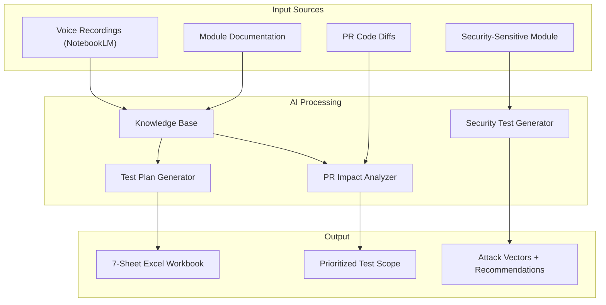

# AI Test Case Generator

> A reusable AI-powered QA methodology — describe a module in plain English, get a complete test plan with 28 regression categories, PR impact analysis, and security assessment. No test case is written manually.

> **Quick overview?** Download the [AI_Test_Plan_Generator.pptx](./AI_Test_Plan_Generator.pptx) presentation deck (7 slides).

---

## What This Solves

| Traditional QA Problem | What This Framework Does Instead |
|------------------------|--------------------------------|
| Writing test cases takes days | Describe the module → get 200+ structured test scenarios in minutes |
| PR impact analysis is guesswork | Feed the PR diff + module knowledge to AI → get a prioritized test scope with time estimates |
| Security testing is an afterthought | Security vectors are generated alongside functional tests — adversarial thinking built into the process |
| Test plans go stale after one sprint | Knowledge base is the source of truth — regenerate the plan anytime the system changes |
| Dev/QA handoff is messy | Single Excel workbook with Dev/QA dual tracking and auto-discrepancy detection |
| Test coverage is invisible | Dashboard shows release readiness (RED/YELLOW/GREEN), progress bars, severity distribution — all formula-driven |

---

## The Three Components



---

### 1. Test Plan Generator (`PROMPT.md`)

**Input**: A plain-English description of a module (or a NotebookLM voice transcription).
**Output**: A Node.js script that generates a formatted 7-sheet Excel workbook.

**How it works:**
1. Write or dictate what the module does — features, user roles, edge cases, business rules
2. Feed the description to any AI assistant using the reusable prompt
3. AI analyzes the module, proposes the test plan structure, and discusses it with you before generating
4. AI generates a Node.js script using ExcelJS that produces the formatted workbook
5. Run the script → get a complete, production-ready test plan

**The Voice-to-Knowledge Pipeline:**

One of the most effective parts of this framework is the voice capture step. Instead of typing module descriptions (which is slow and misses edge cases), you record yourself walking through the module using Google NotebookLM. NotebookLM transcribes and structures the recording. This structured document becomes the knowledge base input for test plan generation.

Voice capture is faster than typing, captures informal observations that you'd normally forget, and AI structures it into a format suitable for test generation.

---

### 2. PR Impact Analyzer (`PR_REVIEW_PROMPT.md`)

**Input**: Code diff from a pull request + module knowledge base.
**Output**: Prioritized test scope with time estimates.

**How it works:**
1. Developer raises a PR
2. Feed the code diffs + module knowledge base to AI with this prompt
3. AI identifies: what's directly changed, what shares dependencies, what can be safely skipped, and any security concerns
4. Output: a prioritized test scope with estimated hours — test strategy defined before execution starts

This is shift-left testing in practice. Instead of waiting for a build and then figuring out what to test, you know your exact test scope the moment a PR is raised.

---

### 3. Security Test Generator

**Input**: Details about a security-sensitive module.
**Output**: Attack vectors with detectability flags and developer recommendations.

**How it works:**
1. Identify a security-sensitive module (exams, payments, authentication)
2. Feed module details to AI with the adversarial testing prompt
3. AI generates attack vectors across categories: client-side manipulation, network interception, environment spoofing, business logic abuse
4. Each vector tagged with Detectable? (Yes/No/Partial) and recommendations for the development team

**Real-world application:** During Safe Exam Browser (SEB) integration at my company, I used this approach to analyze SEB's open-source codebase. AI was able to identify architecture-level security gaps and generate a working proof-of-concept that bypassed 7 security controls — demonstrating that the server never validated client binary integrity. This was reported as a CRITICAL finding with P0-P3 prioritized recommendations before the feature reached production.

The key insight: client-side security is advisory. Security must be enforced server-side. AI makes finding these architectural gaps dramatically faster.

---

## Output: 7-Sheet Excel Workbook

| Sheet | Purpose | Who Uses It |
|-------|---------|------------|
| **HOW IT WORKS** | Business-friendly visual overview, no QA jargon | Everyone / Stakeholders |
| **SECURITY ANALYSIS** | Architecture map, mode vs feature matrix, risk register | Security / Architecture |
| **FOUND BUGS** | Dev/QA dual tracking, component routing, root cause, discrepancy formula | Dev + QA |
| **SECURITY VECTORS** | All attack vectors with Detectable? = Yes/No/Partial, dev recommendations | Security team |
| **REGRESSION SUITE** | Complete test cases with 28 categories, environment, linked bugs | QA team |
| **NOTES & OPEN ITEMS** | Edge cases, open questions, observations, recommendations | QA / Product |
| **DASHBOARD** | 100% formula-driven: Release Readiness (RED/YELLOW/GREEN), progress bars, KPIs | Management / Leads |

### Dashboard Features (Zero Manual Counting)
- **Release Readiness Indicator**: RED (critical bugs open) / YELLOW (bugs in progress) / GREEN (all clear)
- **Progress bars**: Test execution %, bug fix %, security vector coverage
- **Severity distribution**: Visual breakdown of bug severity
- **All formula-driven**: No manual counting. Update a test result or bug status → dashboard updates automatically.

---

## Technical Details

- **ExcelJS** for Excel generation — formatting, formulas, dropdowns, conditional formatting, merged cells
- **Node.js scripts** for workbook assembly and consolidation
- Supports consolidating multiple module workbooks into a single release-level workbook
- Each workbook has consistent structure (28 regression categories) making cross-module analysis possible

---

## How To Use

### Generate a Test Plan

```bash
# 1. Describe your module (or use NotebookLM voice transcription)
# 2. Feed the description + PROMPT.md to any AI (Claude, ChatGPT, etc.)
# 3. AI generates a Node.js script
# 4. Run it:
npm install exceljs
node generated_test_plan.js
# → Opens a formatted Excel workbook with all 7 sheets
```

### Analyze a PR

```bash
# 1. Get the PR diff (git diff main...feature-branch)
# 2. Feed the diff + module knowledge base + PR_REVIEW_PROMPT.md to AI
# 3. AI returns: affected areas, test scope, estimated hours, risk level
```

---

## Real Results

This framework was used in production for the Examination Management System:
- **284+ test scenarios** generated across 28 regression categories
- **65+ security vectors** documented for Safe Exam Browser integration
- **Formula-driven dashboard** with release readiness tracking
- **PR-based test scoping** reduced testing time by defining exact scope before execution

---

## File Structure

```
ai-test-case-generator/
├── README.md                    ← You are here
├── PROMPT.md                    ← Test Plan Generator (reusable prompt)
├── PR_REVIEW_PROMPT.md          ← PR Impact Analyzer (reusable prompt)
├── architecture/                ← Architecture diagrams (draw.io)
├── consolidate_excel.js         ← Merge multiple module workbooks
├── add_overview_sheet.js        ← Add overview dashboard to workbook
├── rebuild_excel.js             ← Rebuild workbook from config
├── package.json                 ← Dependencies (exceljs)
└── security-assessment/         ← Security testing approach documentation
    └── README.md                ← SEB assessment findings (sanitized)
```

---

## License

MIT
