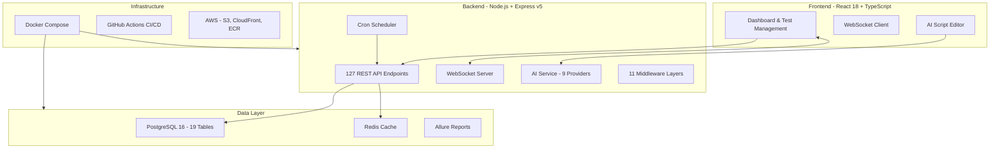

# Autonomous QA Platform

> A full-stack AI-powered test management platform — record, execute, analyze, and schedule web application tests with AI-assisted editing and real-time monitoring.

---

## What This Is

An intelligent test automation platform where QA teams can record browser interactions, manage test scripts, execute them on schedule, and get AI-powered insights — all from a single dashboard. Think of it as a self-hosted alternative to tools like Testim or Mabl, but with full AI integration and complete control over your data.

This was built as a personal project to solve real pain points in my daily testing workflow: recording tests shouldn't require writing code from scratch, test management shouldn't live in spreadsheets, and AI should help you fix failing tests, not just report them.

---

## Architecture



---

## Key Features

| Feature | How It Works |
|---------|-------------|
| **Playwright Test Recording** | Record browser interactions using Playwright Codegen + MCP server integration. AST parsing (Babel) converts raw recordings into clean, structured scripts. |
| **AI Script Editor** | Cursor-style AI chat for test scripts. Ask questions or request changes — AI detects intent (analysis vs modification) and presents code changes with Accept/Reject confirmation. Never overwrites without approval. |
| **9 AI Providers** | Claude, OpenAI, Gemini, Groq, Ollama, Mistral, Cohere, LocalAI, Custom endpoints. Circuit breaker pattern with automatic failover and exponential backoff. |
| **Real-time Execution** | WebSocket-based live monitoring. Watch tests run in real-time with step-by-step output streaming. |
| **Visual Cron Scheduler** | Drag-and-drop scheduling with IST default and 10 timezone support. PostgreSQL advisory locks prevent duplicate executions. |
| **Webhook Notifications** | Send results to Google Chat, Slack, Teams, Discord, or custom endpoints. Structured cards with pass/fail summary and direct report links. |
| **Allure Report Integration** | Automatic Allure report generation and serving. Historical trend data across test runs. |
| **Excel Export** | Multi-sheet workbooks with AST-parsed markdown descriptions. Professional test documentation from your test suite. |
| **Dashboard KPIs** | Real-time statistics with dual storage pattern (columns + JSONB metadata). Execution trends, pass rates, failure analysis. |
| **Drag-Drop Reordering** | Reorder 200+ test items with smooth performance using IntersectionObserver and requestAnimationFrame. |

---

## Platform Stats

### Backend
- **127 REST API endpoints** across 14 route modules
- **66 business logic services** (9 atomic services with transaction rollback)
- **11 middleware layers**: auth (JWT), RBAC, CSRF protection, audit logging, input validation, compression, caching, rate limiting, security headers, health checks, request logging
- **19 PostgreSQL tables** via Prisma ORM with cascade deletes and JSONB metadata columns

### Frontend
- **152+ React components** in TypeScript
- **7 React Context providers** for state management
- **PWA** — installable Progressive Web App with offline support
- **WCAG 2.1 AA** accessible (keyboard navigation, screen reader support)

### Testing
- **8,578 automated tests** (8,559 passing)
- **Backend**: 4,787 tests, 85% coverage, 101 test files
- **Frontend**: 3,791 tests, 70% coverage, 110 test files
- Frameworks: Jest, React Testing Library, Playwright E2E, MSW, jest-axe

### Code Scale
- **55,000+ lines of code** (Backend: ~22K, Frontend: ~33K)
- **89 npm packages** across root + frontend

---

## Tech Stack

| Layer | Technologies |
|-------|-------------|
| **Frontend** | React 18, TypeScript, TailwindCSS, Recharts, React Router v6, Socket.IO client |
| **Backend** | Node.js, Express.js v5, JWT, CSRF, Socket.IO |
| **Database** | PostgreSQL 16 (Prisma ORM), Redis |
| **AI** | Claude, OpenAI, Gemini, Groq, Ollama, Mistral, Cohere (circuit breaker + retry) |
| **Testing** | Jest, React Testing Library, Playwright, MSW, jest-axe |
| **Infrastructure** | Docker Compose, GitHub Actions, AWS (S3, CloudFront, ECR) |
| **Reporting** | Allure Reports, ExcelJS |
| **Security** | AES-256 API key encryption, RBAC, audit logging, rate limiting |

---

## Distributed System Patterns

This platform uses patterns you'd find in production distributed systems:

- **Transaction rollback** — 9 atomic services ensure data integrity on failure
- **Circuit breaker** — AI provider failover with automatic recovery
- **Exponential backoff** — Resilient API retry logic
- **Advisory locks** — PostgreSQL-level locking prevents duplicate cron executions
- **Event-driven scheduling** — Decoupled scheduler with job queue
- **Dual storage** — Columns for queries + JSONB for flexible metadata
- **Audit logging** — Every user action tracked for compliance

---

## Project Structure

```
autonomous-qa-platform/
├── backend/
│   ├── server.js                    # Express v5 application entry
│   ├── routes/                      # 14 route modules (127 endpoints)
│   ├── services/                    # 66 business logic services
│   ├── middleware/                   # 11 middleware layers
│   ├── scheduler/                   # Cron job management
│   └── tests/                       # 4,787 backend tests
├── frontend/
│   ├── src/
│   │   ├── components/              # 152+ React components
│   │   ├── contexts/                # 7 context providers
│   │   ├── hooks/                   # Custom React hooks
│   │   └── utils/                   # Shared utilities
│   └── public/                      # Static assets
├── prisma/
│   ├── schema.prisma                # 19 tables, 33 indexes
│   └── migrations/                  # Database migrations
├── docs/
│   ├── diagrams/                    # 18 draw.io architecture diagrams
│   └── guides/                      # 20+ documentation files
├── scripts/                         # Deployment & utility scripts
└── docker-compose.yml               # Multi-container orchestration
```

---

## Architecture Diagrams

This project includes **18 detailed draw.io architecture diagrams** covering every major system flow:

| Diagram | What It Shows |
|---------|--------------|
| Master System Overview | Complete system architecture |
| Test Execution Flow | Single test lifecycle (simple → detailed → complete) |
| Test Recording Flow | Browser recording → script generation |
| Bulk Execution Flow | Parallel test execution |
| Scheduled Execution | Cron-based automation |
| AI Script Analysis | AI-powered script understanding |
| AI Failure Analysis | Intelligent failure diagnosis |
| Flow Management | CRUD operations for test flows |
| Data Cleanup & Retention | Automated data lifecycle |
| Webhook Notifications | Multi-platform alert delivery |
| System Health Monitoring | Platform health checks |
| Allure Report Generation | Report creation pipeline |
| User Authentication | JWT + RBAC flow |
| Settings & Audit Log | Configuration and tracking |

All diagrams are available in the `architecture/` folder in draw.io format.

---

## Future Vision

```
autonomous-qa-platform (current)
├── Web UI Automation (Playwright) ✅
├── AI Script Editing + Analysis ✅
├── Test Scheduling (cron) ✅
├── API Automation Module — planned
├── Mobile Automation Module (Appium) — planned
├── Manual Testing Module — planned
└── Security Testing Module — planned
```

The goal is a single platform where a QA team handles all testing types — UI, API, mobile, manual, security — with AI assistance at every step.

---

## License

MIT
