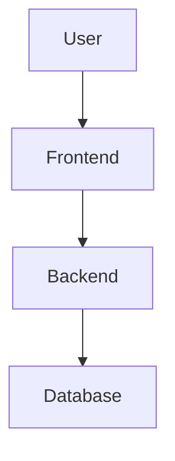

# 📊 Autonomous QA - Architecture Diagrams & Visualization Guide

**Last Updated**: December 12, 2025  
**Purpose**: Comprehensive visual documentation of the Autonomous QA platform architecture, data flows, and system interactions.

---

## 📁 Directory Structure

```
docs/diagrams/
├── README.md                           # This file - complete usage guide
├── drawio/                             # Draw.io XML diagrams (import directly)
│   └── 01-test-execution-flow.drawio   # Single test execution flow
├── plantuml/                           # PlantUML diagrams (widely compatible)
│   └── scheduled-execution-flow.puml   # CronJobManager scheduling flow
├── mermaid/                            # Mermaid diagrams (GitHub/VSCode native)
│   └── (extracted from ERD.md)         # All flow diagrams available
└── mindmap/                            # Mindmap files (architecture overview)
    └── autonomous-qa-architecture.md   # Complete system mindmap
```

---

## 🎨 Diagram Types & When to Use

| Format | Best For | Tools | Editability | Complexity |
|--------|----------|-------|-------------|------------|
| **Draw.io (.drawio)** | Detailed flowcharts, swim-lane diagrams | draw.io, diagrams.net | ⭐⭐⭐⭐⭐ Full visual editor | High detail |
| **PlantUML (.puml)** | Sequence diagrams, class diagrams, component diagrams | PlantUML, IDEs with plugins | ⭐⭐⭐⭐ Text-based editing | Medium |
| **Mermaid (.mmd / .md)** | Quick visualizations, GitHub README diagrams | GitHub, GitLab, VSCode, Notion | ⭐⭐⭐ Simple text syntax | Low-Medium |
| **Mindmap (.md)** | Architecture overview, concept mapping | Markmap, FreeMind, XMind | ⭐⭐⭐⭐ Markdown-based | High overview |

---

## 🖼️ Complete Diagram Catalog (15 Comprehensive Diagrams)

### 🗺️ Master Overview Diagram

**00. Master System Overview** (`drawio/00-master-system-overview.drawio`) ⭐⭐⭐⭐⭐
- **Purpose**: Bird's-eye view of entire system showing all 14 major flows interconnected
- **Dimensions**: 2400x2000px
- **Includes**:
  - All 14 flows with descriptions
  - Database layer (19 tables, 33 indexes, 7 unique constraints)
  - Technology stack (Backend, Frontend, Testing, DevOps)
  - System characteristics (Real-time, Atomic, Scalable, Observable)
  - Production capacity metrics and scale details
- **Best For**: Onboarding new team members, architecture reviews, executive presentations

---

### 🚀 CORE EXECUTION FLOWS (4 diagrams)

#### 1. Single Test Execution Flow (`drawio/01-test-execution-flow-complete.drawio`)
- **8 Swim Lanes**: User/Frontend, Backend API, Execution Service, Playwright Process, Database & Assets, AI Analysis (if failed), Post-Execution, Final Response
- **150+ Nodes**: Complete lifecycle from API call to final response
- **Key Features**:
  - TestRun state machine (10 states)
  - Parallel Fork/Join patterns
  - AI failure analysis integration
  - Retry logic with exponential backoff
  - Progress calculation formulas
  - Critical vs non-critical failure handling
- **Services**: testExecutionService.js, atomicFlowSaveService.js, globalAIService.js

#### 2. Test Recording & Creation Flow (`drawio/02-test-recording-flow.drawio`)
- **7 Swim Lanes**: User/Frontend, Backend API, Recording Service, Playwright Codegen, File Watcher & AST Parser, Atomic Save Service, Audit & Response
- **60+ Nodes**: From initiating recording to saving parsed test
- **Key Features**:
  - Playwright codegen spawn process
  - AST parsing with Babel
  - File watcher integration
  - Atomic transaction save with versioning
- **Services**: recordingService.js, astPlaywrightParser.js, atomicFlowSaveService.js

#### 3. Bulk Execution Flow (`drawio/03-bulk-execution-flow.drawio`)
- **7 Swim Lanes**: User/Frontend, Backend API, Bulk Execution Service, Individual Test Loop, Aggregation & Statistics, Webhook Notification, Final Response
- **70+ Nodes**: Tag-based execution with parallel/sequential modes
- **Key Features**:
  - Worker pool management
  - Fork/Join patterns
  - Individual test execution loop
  - Statistics aggregation
  - Bulk summary webhooks
- **Services**: bulkExecutionService.js, testExecutionService.js, webhookService.js

#### 4. Scheduled Execution Flow (`drawio/04-scheduled-execution-flow.drawio`)
- **7 Swim Lanes** across 3 phases: Server Startup & Initialization, Runtime Execution (with PostgreSQL advisory locks), Dynamic Updates
- **80+ Nodes**: Event-driven cron scheduling
- **Key Features**:
  - node-cron integration
  - PostgreSQL advisory locks for multi-server safety
  - Missed job detection & recovery
  - Dynamic job updates (add/edit/delete)
  - Graceful shutdown
- **Services**: CronJobManager.js, scheduledExecutionService.js

---

### 🤖 AI & ANALYSIS FLOWS (2 diagrams)

#### 5. AI Script Analysis Flow (`drawio/05-ai-script-analysis-flow.drawio`)
- **6 Swim Lanes**: User/Frontend, Backend API + Intent Detection, Global AI Service, Context Building, AI API Call, Response Processing
- **60+ Nodes**: Multi-provider AI script analysis
- **Key Features**:
  - 9 AI providers (OpenAI, Claude, Gemini, Groq, Ollama, Mistral, Cohere, LocalAI, Custom)
  - Intent detection (QUESTION vs MODIFICATION)
  - Knowledge base integration
  - Retry with exponential backoff
  - Fallback to next provider
  - Circuit breaker pattern
  - Usage tracking
- **Services**: globalAIService.js, 9 provider files, knowledgeBaseManager.js, usageTracker.js

#### 6. AI Failure Analysis & Deviation Detection (`drawio/06-ai-failure-analysis-flow.drawio`)
- **5 Swim Lanes**: Trigger (after test failure), Data Collection, AI Provider Call, Deviation Storage, Frontend Display
- **40+ Nodes**: Automatic root cause analysis
- **Key Features**:
  - Triggered automatically after test failure (non-blocking)
  - Collects test context (failed steps, errors, screenshots)
  - AI analysis (root cause, suggested fix, confidence score)
  - Deviation storage with metadata
  - WebSocket notification to frontend
- **Services**: globalAIService.js, deviationAnalyzer.js, usageTracker.js

---

### 📦 DATA MANAGEMENT FLOWS (3 diagrams)

#### 7. Flow Management CRUD Operations (`drawio/07-flow-management-crud-flow.drawio`)
- **5 Operations**: CREATE, UPDATE, CLONE, MOVE, DELETE (each with its own swim lane)
- **50+ Nodes**: Complete CRUD lifecycle
- **Key Features**:
  - Atomic transactions with Prisma
  - Version control (TestFlowVersion)
  - Backup & rollback
  - Soft delete vs hard delete
  - Permission checks
  - Audit logging for all operations
- **Services**: atomicFlowSaveService.js, flowService.js, astPlaywrightParser.js

#### 8. Folder Management (`drawio/08-folder-management-flow.drawio`)
- **4 Operations**: CRUD, Recursive Clone, Move (update hierarchy), Common Hierarchy Queries
- **40+ Nodes**: Self-referencing hierarchy management
- **Key Features**:
  - Recursive clone (all nested folders + all flows)
  - Path-based organization (unique path constraint)
  - CTE queries for tree traversal
  - Circular reference protection
  - Depth calculation
- **Services**: folderService.js, atomicFolderCloneService.js, atomicFlowSaveService.js

#### 9. Data Cleanup & Retention (`drawio/09-data-cleanup-retention-flow.drawio`)
- **6 Swim Lanes**: Trigger Sources, Load Retention Policies, Query Eligible Runs, Cleanup Execution, Orphan Detection, Summary & Response
- **40+ Nodes**: Policy-based deletion with dry-run
- **Key Features**:
  - Configurable retention policies (TestRun, artifacts, failed/successful runs)
  - Dry-run preview mode
  - Orphan file detection (files without DB records)
  - Scheduled cron (daily at 3 AM)
  - Batch processing (1000 runs per execution)
  - Non-blocking, async execution
- **Services**: cleanupService.js, cleanupScheduler.js (cron)

---

### 🔧 SYSTEM & MONITORING FLOWS (5 diagrams)

#### 10. Webhook Notification Flow (`drawio/10-webhook-notification-flow.drawio`)
- **5 Swim Lanes**: Trigger Sources, Webhook Service, Payload Building, HTTP POST, External Services
- **35+ Nodes**: Fire-and-forget notifications
- **Key Features**:
  - 17 selectable fields (field-based payload building)
  - Google Chat cards, Slack blocks, Teams adaptive cards, Discord embeds, Custom JSON
  - Multiple active webhooks support
  - Fire-and-forget pattern (never blocks test execution)
  - 5-second timeout per webhook
  - Silent failure with logging
- **Services**: webhookService.js, webhookPayloadBuilder.js

#### 11. System Health Monitoring (`drawio/11-system-health-monitoring-flow.drawio`)
- **4 Probes**: Startup, Readiness, Liveness, Detailed Health (Admin)
- **30+ Nodes**: Kubernetes-ready health checks
- **Key Features**:
  - Startup probe (initial boot validation)
  - Readiness probe (can accept traffic?)
  - Liveness probe (is app alive?)
  - Detailed health endpoint (admin dashboard with comprehensive metrics)
  - DB/Redis connection checks
  - Service status checks
  - CPU/Memory/Disk metrics
- **Services**: healthService.js, metricsCollector.js

#### 12. Allure Report Generation & Serving (`drawio/12-allure-report-generation-flow.drawio`)
- **6 Swim Lanes**: Test Execution Context, Report Generation, Enrichment, Storage & URL Update, Static Serving, Cleanup
- **30+ Nodes**: Playwright JSON → Allure HTML
- **Key Features**:
  - Allure CLI spawn (child process)
  - Enrichment with custom metadata (environment, user, tags)
  - Express static middleware for serving
  - WebSocket notification when report ready
  - Scheduled cleanup (30-day retention)
- **Services**: allureReportService.js, cleanupService.js

#### 13. User Authentication & Authorization (`drawio/13-user-authentication-flow.drawio`)
- **4 Flows**: Registration, Login, Protected Route Access, RBAC
- **40+ Nodes**: JWT + bcrypt + RBAC
- **Key Features**:
  - bcrypt password hashing (10 salt rounds, ~100ms)
  - JWT token generation (7-day expiry)
  - authMiddleware for protected routes
  - requireRole middleware for RBAC
  - 4 roles (user, admin, viewer, executor)
  - Token verification on every request
- **Services**: authService.js, authMiddleware.js, requireRole.js

#### 14. Settings Management & Audit Logging (`drawio/14-settings-audit-log-flow.drawio`)
- **5 Swim Lanes** (Settings): GET, UPDATE, Audit Capture, Audit Query, Retention & Export
- **30+ Nodes**: Key-value store + compliance
- **Key Features**:
  - 7 setting categories (general, cleanup, ai, notification, execution, report, security)
  - JSON schema validation with Zod
  - Automatic audit trail for all mutations (CREATE, UPDATE, DELETE, EXECUTE, LOGIN, CLONE, MOVE)
  - SOC 2 / GDPR / HIPAA / ISO 27001 ready
  - 4 indexes on audit_logs (userId, resource, createdAt, action)
  - CSV export for compliance reporting
  - Optional cold storage archival (S3/Azure)
- **Services**: settingsService.js, auditLogger.js (middleware)

---

### 📊 Diagram Statistics

| Metric | Count |
|--------|-------|
| **Total Diagrams** | 15 (1 master + 14 detailed flows) |
| **Total Nodes** | 700+ across all diagrams |
| **Total Swim Lanes** | 80+ across all diagrams |
| **Decision Points** | 100+ (rhombus nodes) |
| **Error Paths** | 50+ (failure/rollback flows) |
| **Services Documented** | 60+ backend services |
| **Database Tables** | 19 tables with 33 indexes |
| **Total Diagram Size** | ~15,000 lines of XML |

---

### 🎯 Quick Reference: Which Diagram for Which Task?

| Your Goal | Recommended Diagram(s) |
|-----------|------------------------|
| **Understand overall system** | 00-master-system-overview.drawio |
| **Debug test execution** | 01-test-execution-flow-complete.drawio |
| **Add new AI provider** | 05-ai-script-analysis-flow.drawio |
| **Understand cron scheduling** | 04-scheduled-execution-flow.drawio |
| **Implement webhooks** | 10-webhook-notification-flow.drawio |
| **Setup Kubernetes probes** | 11-system-health-monitoring-flow.drawio |
| **CRUD operations** | 07-flow-management-crud-flow.drawio, 08-folder-management-flow.drawio |
| **Data retention policies** | 09-data-cleanup-retention-flow.drawio |
| **Authentication/security** | 13-user-authentication-flow.drawio |
| **Compliance/audit** | 14-settings-audit-log-flow.drawio |

---

### 1. Test Execution Flow (Draw.io) - THREE VERSIONS (LEGACY - Use diagram 01 above instead)

#### 1A. Expert-Grade Complete Version (RECOMMENDED FOR TECHNICAL TEAMS) ⭐⭐⭐
- **File**: `drawio/01-test-execution-flow-complete.drawio`
- **Type**: Multi-swim-lane diagram with **STATE TRANSITIONS** + **PARALLEL PROCESSES** + **AI ANALYSIS**
- **Dimensions**: 2400x3400px (extra large, most comprehensive)
- **Unique Features** (NOT in other versions):
  1. **TestRun State Transition Timeline** (NEW!): Visual state machine showing status changes (NULL → RUNNING → EXECUTING → PROCESSING → ANALYZING → REPORTING → PASSED/FAILED → NOTIFYING → COMPLETED)
  2. **Parallel Execution Fork/Join** (NEW!): Shows what runs simultaneously (DB insert, WebSocket emit, file validation all at once)
  3. **AI Analysis Layer** (NEW!): Complete flow of AI failure analysis:
     - globalAIService.js analyzes failed tests
     - Loads primary AI provider (OpenAI/Claude/Gemini)
     - Builds context with screenshots, errors, selectors
     - Calls AI API with retry + exponential backoff
     - Parses response (root cause, suggested fix, severity)
     - Creates Deviation record in database
     - Tracks AI usage (tokens, cost)
     - Emits WebSocket 'ai:analysis:complete'
     - Circuit breaker pattern (5 failures → disable 5min)
     - Fallback to next provider on failure
  4. **Retry Logic Visualization** (NEW!): Shows 3x retry with exponential backoff (1s, 2s, 4s)
  5. **Progress Calculation** (NEW!): Shows formula `progress = (currentStep / totalSteps) * 100`
  6. **Rate Limiting Layer** (NEW!): Shows 30 req/min check → 429 Too Many Requests path
  7. **Resource Management** (NEW!): Browser instance lifecycle, temp file cleanup
  8. **Critical Failure Handling** (NEW!): Stop test on critical errors vs continue on non-critical
  9. **Step Counter & Loop** (NEW!): FOR loop visualization with i from 1 to N
  10. **Enhanced Security** (NEW!): Rate limiting, input sanitization, CSRF checks visualized
  
- **Swim Lanes** (8 layers):
  0. **State Transition Timeline** (NEW!) - Visual state machine at top
  1. **User/Frontend Layer** - React + WebSocket with detailed event payloads
  2. **Backend API + Security** - Rate limiting + Auth + Audit + Validation
  3. **Execution Service + Resource Mgmt** - Parallel fork/join, upload checks
  4. **Playwright Execution + Step Loop** - Complete loop with retry logic
  5. **AI Analysis** (NEW!) - Failure analysis with Deviation creation
  6. **Post-Execution** - Reports, assets, webhooks (to be added)
  7. **Database Layer** - All 6 tables with transaction details
  8. **File System Layer** - All directories and file types
  
- **Components** (100+ nodes):
  - State transitions: 9 states with color-coded arrows
  - Parallel execution: Fork → 4 branches → Join
  - AI analysis: 10 nodes from check to deviation creation
  - Retry logic: 3 attempt loops with backoff
  - Progress tracking: Step counter and percentage calculation
  - Error paths: 8 failure scenarios with rollback
  - Decision points: 15 decision nodes
  - WebSocket events: 6 real-time updates with payload details
  
- **Best For**:
  - Technical deep-dive sessions
  - Architecture review meetings
  - Developer onboarding (complete system understanding)
  - Troubleshooting complex issues
  - System design discussions
  - Understanding AI integration
  - Performance optimization planning
  
#### 1B. Detailed Production-Grade Version (GOOD FOR GENERAL USE)
- **File**: `drawio/01-test-execution-flow-detailed.drawio`
- **Type**: Multi-swim-lane diagram (6 layers) with complete flow
- **Shows**: End-to-end execution with all services, decisions, error paths
- **Swim Lanes**:
  1. **User/Frontend Layer**: React + WebSocket real-time updates
  2. **Backend API Layer**: Express routes + middleware (auth, audit, validation)
  3. **Execution Service Layer**: Business logic + file operations
  4. **Playwright Execution Layer**: Child process + browser automation
  5. **Post-Execution Layer**: Reports, assets, webhooks, notifications
  6. **Database Layer**: All tables involved (TestRun, TestRunStep, TestAsset, etc.)
  7. **File System Layer**: Screenshots, videos, traces, Allure reports
- **Components** (50+ nodes):
  - User click → API call → Auth middleware → Execution service
  - Playwright spawn → Browser launch → Step execution loop
  - Screenshot capture → Database save → WebSocket progress
  - Allure report generation → Asset collection → Stats calculation
  - Webhook notifications → Final response → Cleanup
- **Decision Points**: 8 decision nodes (auth check, flow exists, upload required, step success, webhook enabled, etc.)
- **Error Paths**: 4 error paths with rollback (401 Unauthorized, 404 Not Found, upload missing, step failed)
- **Timing Annotations**: Auth (~50ms), Execution (1-5min), Allure (~5-10s)
- **Legend**: Success paths, error paths, WebSocket events, database operations, decision points
- **Dimensions**: 2000x2800px (large, detailed diagram)
- **Import Into**: draw.io, diagrams.net, Confluence, Lucidchart (import as XML)

#### 1B. Simple Overview Version (for quick reference)
- **File**: `drawio/01-test-execution-flow.drawio`
- **Type**: Simple flowchart with color-coded components
- **Shows**: High-level single test execution flow
- **Best For**: Quick overview, presentations, documentation thumbnails
- **Import Into**: draw.io, diagrams.net, Confluence, Lucidchart

### 2. Scheduled Execution Flow (PlantUML)
- **File**: `plantuml/scheduled-execution-flow.puml`
- **Type**: Sequence diagram with swim-lanes
- **Shows**: CronJobManager event-driven scheduling, PostgreSQL advisory locks, missed job detection
- **Phases**: Initialization, Runtime Execution, Dynamic Updates, Fault Tolerance
- **Render With**: PlantUML CLI, VSCode PlantUML extension, IntelliJ IDEA, Online PlantUML server

### 3. Complete Architecture Mindmap (Markmap)
- **File**: `mindmap/autonomous-qa-architecture.md`
- **Type**: Hierarchical mindmap (2,800+ lines)
- **Shows**: Entire system architecture from database to deployment
- **Sections**:
  - Database Layer (19 tables)
  - Backend Architecture (66 services, 14 route modules)
  - Frontend Architecture (152+ components)
  - Data Flow Patterns (8 major flows)
  - Security, Performance, Testing, DevOps
- **View With**: Markmap extension (VSCode), Markmap CLI, FreeMind, XMind

### 4. All Flow Diagrams (Mermaid in ERD.md)
- **File**: `../ERD.md` (Data Flow Patterns section)
- **Type**: Mermaid flowcharts and sequence diagrams
- **Available Diagrams** (8 total):
  1. Test Recording & Creation Flow
  2. Single Test Execution Flow (Sequence Diagram)
  3. Bulk Execution Flow (Parallel vs Sequential)
  4. Scheduled Execution Flow (CronJobManager)
  5. Webhook Notification Flow
  6. AI Analysis Flow
  7. Data Cleanup & Retention Flow
  8. User Authentication & Authorization Flow
- **View With**: GitHub (native rendering), VSCode Markdown Preview, Mermaid Live Editor

---

## 🚀 How to Use Each Format

### Option 1: Draw.io Files (.drawio)

#### View/Edit in draw.io Desktop
1. Download draw.io: https://www.drawio.com/
2. Open File → Open File → Select `.drawio` file
3. Edit, zoom, export as PNG/SVG/PDF

#### View/Edit Online
1. Go to https://app.diagrams.net/
2. File → Open From → Device
3. Select `.drawio` file
4. Edit directly in browser

#### Import into Other Tools
- **Confluence**: Attachments → Select draw.io file → Opens in Confluence editor
- **Lucidchart**: Import → Select "Lucidchart format" → Upload `.drawio` file
- **Microsoft Visio**: Not directly supported, export to SVG from draw.io first

#### Export Options
```bash
# From draw.io CLI (if installed)
drawio --export --format png --output test-flow.png 01-test-execution-flow.drawio
drawio --export --format svg --output test-flow.svg 01-test-execution-flow.drawio
drawio --export --format pdf --output test-flow.pdf 01-test-execution-flow.drawio
```

---

### Option 2: PlantUML Files (.puml)

#### Render in VSCode (Recommended)
1. Install extension: "PlantUML" by jebbs
2. Install Graphviz: `choco install graphviz` (Windows) or `brew install graphviz` (Mac)
3. Open `.puml` file in VSCode
4. Press `Alt+D` to preview diagram
5. Right-click → Export as PNG/SVG/PDF

#### Render with PlantUML CLI
```bash
# Install PlantUML
npm install -g node-plantuml

# Render to PNG
puml generate scheduled-execution-flow.puml -o output.png

# Render to SVG
puml generate scheduled-execution-flow.puml -o output.svg
```

#### Online Rendering
1. Go to http://www.plantuml.com/plantuml/uml/
2. Paste `.puml` file content
3. Click "Submit" → View diagram
4. Download as PNG/SVG

#### Use in IntelliJ IDEA / PyCharm
1. Install "PlantUML integration" plugin
2. Open `.puml` file
3. Right panel shows live preview
4. Right-click → "Copy Image" or "Export Diagram"

#### Use in Confluence
1. Install "PlantUML for Confluence" addon
2. Create page → Insert → Other Macros → PlantUML
3. Paste `.puml` content
4. Diagram renders automatically

---

### Option 3: Mermaid Diagrams (.mmd / .md)

#### View in GitHub (Native)
- Mermaid diagrams in `docs/ERD.md` render automatically on GitHub
- No action needed, just view the file!

#### View in VSCode
1. Install extension: "Markdown Preview Mermaid Support"
2. Open `ERD.md` or any `.md` file with Mermaid
3. Press `Ctrl+Shift+V` (Markdown Preview)
4. Mermaid diagrams render inline

#### Extract to Separate Files
```markdown
<!-- Save as diagrams/mermaid/test-execution.mmd -->

```

#### Render Online
1. Go to https://mermaid.live/
2. Paste Mermaid code
3. View interactive diagram
4. Download as PNG/SVG

#### Use in Confluence
1. Install "Mermaid Diagrams for Confluence" addon
2. Insert → Other Macros → Mermaid Diagram
3. Paste Mermaid code
4. Diagram renders automatically

#### Convert to Draw.io
1. Go to https://mermaid.ink/
2. Paste Mermaid code
3. Download as SVG
4. Import SVG into draw.io

---

### Option 4: Mindmap Files (.md with Markmap)

#### View in VSCode (Best Experience)
1. Install extension: "Markmap"
2. Open `autonomous-qa-architecture.md`
3. Click "Open as Markmap" button (top right)
4. Interactive zoomable mindmap!
5. Export as HTML/SVG

#### Generate HTML Mindmap
```bash
# Install Markmap CLI
npm install -g markmap-cli

# Generate HTML file
markmap autonomous-qa-architecture.md -o architecture.html

# Open in browser
start architecture.html  # Windows
open architecture.html   # Mac
```

#### Convert to FreeMind (.mm)
```bash
# Install markdown-to-mindmap
npm install -g markdown-to-mindmap

# Convert to FreeMind format
md-to-mm autonomous-qa-architecture.md -o architecture.mm

# Open in FreeMind, XMind, or MindManager
```

#### View Online
1. Go to https://markmap.js.org/repl
2. Paste `autonomous-qa-architecture.md` content
3. View interactive mindmap
4. Download as HTML/SVG

#### Use in Notion
1. Copy Markdown content from `autonomous-qa-architecture.md`
2. Paste into Notion page
3. Notion renders as toggle list (not visual mindmap, but navigable)

#### Use in XMind
1. Convert to FreeMind (.mm) format (see above)
2. Open XMind → File → Import → Select .mm file
3. Edit in XMind's visual editor

---

## 🎯 Quick Decision Guide

### "I want to edit a diagram visually with drag-drop"
→ Use **Draw.io** files (`.drawio`)  
→ Open in draw.io or diagrams.net

### "I want to add sequence diagrams to my documentation"
→ Use **PlantUML** files (`.puml`)  
→ Render in VSCode or online PlantUML server

### "I want diagrams that render natively on GitHub"
→ Use **Mermaid** diagrams (in `.md` files)  
→ Already available in `docs/ERD.md`

### "I want a high-level architecture overview"
→ Use **Mindmap** file (`autonomous-qa-architecture.md`)  
→ View with Markmap extension in VSCode

### "I want to present diagrams in a meeting"
→ Export Draw.io to **PNG/PDF**  
→ Or render PlantUML to **SVG**  
→ Or generate Markmap **HTML** (interactive!)

### "I want to embed diagrams in Confluence"
→ Import **Draw.io** files directly  
→ Or use **PlantUML/Mermaid** macros

### "I want to print diagrams for documentation"
→ Export Draw.io to **PDF**  
→ Or render PlantUML to **PDF**  
→ Mermaid to PNG (high resolution)

---

## 📋 Complete Diagram Inventory

| Diagram Name | Format | Location | Shows | Complexity |
|--------------|--------|----------|-------|------------|
| **Test Execution Flow** | Draw.io | `drawio/01-test-execution-flow.drawio` | Single test execution, WebSocket updates, Allure reports | High |
| **Scheduled Execution Flow** | PlantUML | `plantuml/scheduled-execution-flow.puml` | CronJobManager, advisory locks, missed jobs | High |
| **Architecture Mindmap** | Markmap | `mindmap/autonomous-qa-architecture.md` | Complete system (DB, Backend, Frontend, DevOps) | Very High |
| **Test Recording Flow** | Mermaid | `../ERD.md` (line 596) | Recording, AST parsing, atomic save | Medium |
| **Single Execution Flow** | Mermaid | `../ERD.md` (line 656) | Sequence diagram with timing | High |
| **Bulk Execution Flow** | Mermaid | `../ERD.md` (line 803) | Parallel vs sequential, aggregation | Medium |
| **Webhook Flow** | Mermaid | `../ERD.md` (line 929) | Field-based payloads, fire-and-forget | Medium |
| **AI Analysis Flow** | Mermaid | `../ERD.md` (line 1008) | Multi-provider, retry logic, version control | High |
| **Cleanup Flow** | Mermaid | `../ERD.md` (line 1118) | Retention policies, orphan detection | Medium |
| **Auth Flow** | Mermaid | `../ERD.md` (line 1213) | JWT, RBAC, audit logging | Medium |

---

## 🛠️ Tools & Software Recommendations

### Free & Open Source
- **draw.io** (Desktop/Online) - Best for flowcharts
  - Download: https://www.drawio.com/
  - Online: https://app.diagrams.net/
- **PlantUML** (CLI/Plugin) - Best for sequence diagrams
  - Website: https://plantuml.com/
  - VSCode Extension: "PlantUML" by jebbs
- **Mermaid** (Embedded) - Best for GitHub/docs
  - Website: https://mermaid.js.org/
  - Live Editor: https://mermaid.live/
- **Markmap** (CLI/VSCode) - Best for mindmaps
  - Website: https://markmap.js.org/
  - VSCode Extension: "Markmap"
- **FreeMind** (Desktop) - Classic mindmap tool
  - Download: http://freemind.sourceforge.net/

### Commercial Options
- **Lucidchart** - Cloud-based diagramming (draw.io alternative)
- **XMind** - Professional mindmapping (free version available)
- **MindManager** - Enterprise mindmapping
- **Microsoft Visio** - Enterprise diagramming (export to draw.io first)
- **Confluence** - Team collaboration (supports draw.io, PlantUML, Mermaid addons)

---

## 📝 Creating New Diagrams

### Adding a New Draw.io Diagram
1. Open draw.io
2. Create your diagram
3. Save as `.drawio` format
4. Place in `docs/diagrams/drawio/`
5. Name convention: `##-descriptive-name.drawio`
6. Update this README with new entry

### Adding a New PlantUML Diagram
1. Create `.puml` file in `docs/diagrams/plantuml/`
2. Start with:
   ```plantuml
   @startuml Diagram Name
   !theme plain
   
   ' Your diagram code here
   
   @enduml
   ```
3. Preview in VSCode or online
4. Add to this README

### Adding a New Mermaid Diagram
1. Add to existing `.md` file (e.g., `ERD.md`) or create new
2. Use code block with `mermaid` language:
   ````markdown
   ```mermaid
   flowchart TD
       A --> B
   ```
   ````
3. Preview in GitHub or VSCode
4. Reference in this README

### Updating the Mindmap
1. Edit `mindmap/autonomous-qa-architecture.md` (Markdown format)
2. Use Markdown headings (`#`, `##`, `###`) for hierarchy
3. Preview with Markmap extension
4. Regenerate HTML if needed

---

## 🔗 External Resources

### Diagram Syntax References
- **Draw.io**: https://www.drawio.com/doc/
- **PlantUML**: https://plantuml.com/guide
- **Mermaid**: https://mermaid.js.org/intro/
- **Markmap**: https://markmap.js.org/docs/

### Best Practices
- **C4 Model** (Architecture Diagrams): https://c4model.com/
- **UML Diagrams**: https://www.uml-diagrams.org/
- **Flowchart Standards**: https://www.bpmn.org/
- **Sequence Diagrams**: https://www.visual-paradigm.com/guide/uml-unified-modeling-language/what-is-sequence-diagram/

### Conversion Tools
- **Mermaid to Draw.io**: https://mermaid.ink/ (→ SVG → import)
- **PlantUML to Draw.io**: https://plantuml.com/ (→ SVG → import)
- **Markdown to FreeMind**: `npm install -g markdown-to-mindmap`

---

## 💡 Tips & Tricks

### Performance Tips
- Large draw.io files: Split into multiple diagrams for better performance
- PlantUML diagrams: Use `!include` for reusable components
- Mermaid diagrams: Keep under 50 nodes for fast rendering
- Mindmaps: Collapse sections in Markmap for better navigation

### Collaboration Tips
- Store diagram source files (`.drawio`, `.puml`, `.md`) in Git for version control
- Export to PNG/SVG for non-technical stakeholders
- Use draw.io online for real-time collaboration
- Link to online PlantUML/Mermaid renderers in documentation

### Maintenance Tips
- Review diagrams quarterly (or with major feature changes)
- Update mindmap with every new service/component added
- Keep a changelog section in this README
- Tag diagram versions with Git tags

---

## 📞 Support & Questions

### Issues with Diagrams
- Check tool installation (draw.io, PlantUML, Graphviz, Node.js)
- Verify file format compatibility
- Try online renderers first (no installation needed)

### Request New Diagrams
- Open GitHub issue with diagram request
- Specify: Type (flowchart, sequence, mindmap), Content (what to show), Format preference

### Contributing
- Follow naming conventions: `##-descriptive-name.{drawio,puml,mmd,md}`
- Update this README with new diagram entries
- Add diagram description and usage instructions
- Test rendering in multiple tools before committing

---

**Last Updated**: December 12, 2025  
**Maintainer**: Development Team  
**Diagram Count**: 10+ diagrams (4 formats)  
**Total Documentation**: 5,000+ lines of visual architecture

