# 📊 Entity Relationship Diagram (ERD)

**Created**: December 5, 2025  
**Last Updated**: December 11, 2025  
**Database**: PostgreSQL 16+  
**ORM**: Prisma  
**Total Tables**: 19
**Total Indexes**: 33 (+ 7 unique constraints)

---

## Table of Contents

1. [Overview](#overview)
2. [Visual ERD](#visual-erd)
3. [Table Descriptions](#table-descriptions)
4. [Relationship Details](#relationship-details)
5. [Index Strategy](#index-strategy)
6. [Data Flow Patterns](#data-flow-patterns)

---

## Overview

The Autonomous QA platform uses a relational database with 19 tables organized into the following domains:

| Domain | Tables | Purpose |
|--------|--------|---------|
| **User Management** | User, Session, AuditLog | Authentication, sessions, audit trail |
| **Project Organization** | Project, Folder | Test organization hierarchy |
| **Test Flows** | TestFlow, TestFlowVersion, Flow, FlowStep | Test definitions and versioning |
| **Test Execution** | TestRun, TestRunStep, BulkRunFlow, TestAsset, Deviation | Execution results and artifacts |
| **Scheduling** | ScheduledExecution | Automated test scheduling |
| **Notifications** | WebhookConfig | Webhook notifications |
| **Configuration** | AppSettings, AIProvider, Module | System configuration |

---

## Visual ERD

### Core Domain Model

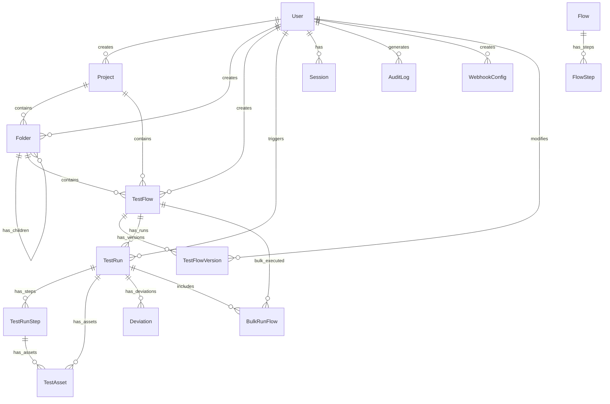

### User Domain

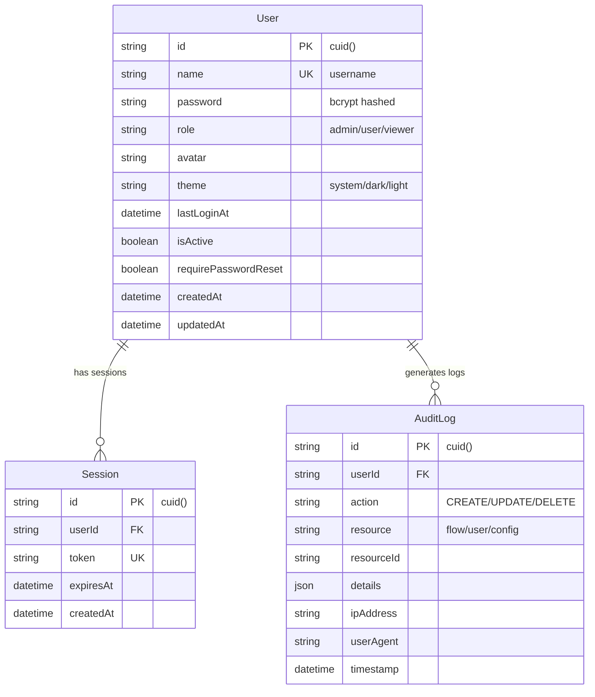

### Test Flow Domain

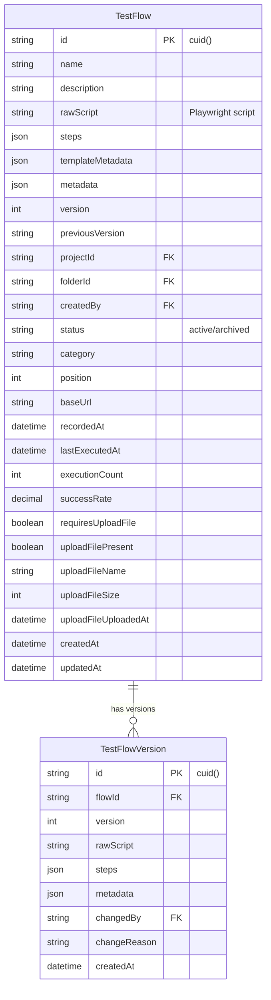

### Test Execution Domain

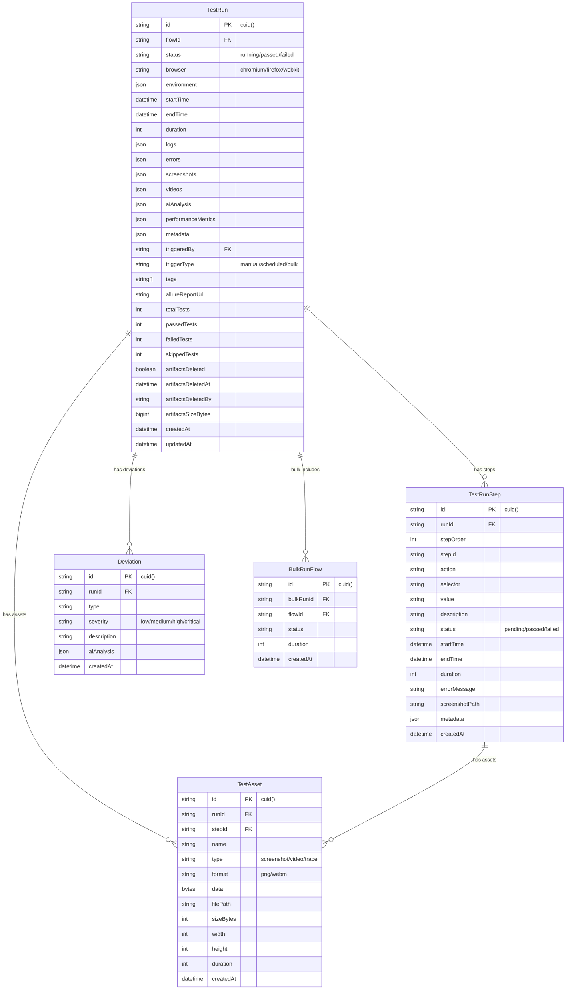

### Scheduling & Notifications

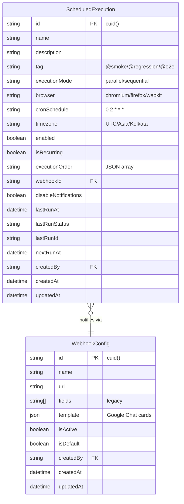

### Project & Folder Domain

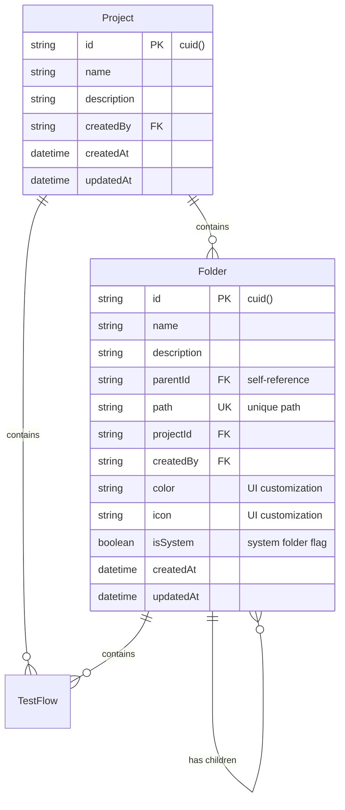

### Configuration Domain

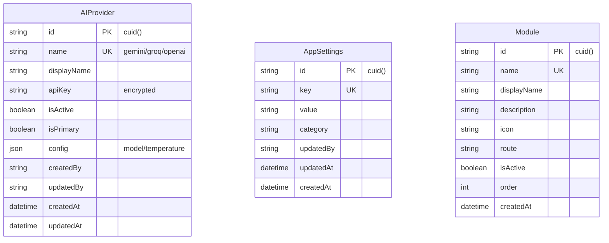

---

## Table Descriptions

### User Management Tables

| Table | Purpose | Key Fields |
|-------|---------|------------|
| **User** | Store user accounts with authentication | `name` (unique username), `password` (bcrypt), `role` |
| **Session** | JWT session management | `token` (unique), `expiresAt` |
| **AuditLog** | Track all user actions | `action`, `resource`, `resourceId`, `timestamp` |

### Project Organization Tables

| Table | Purpose | Key Fields |
|-------|---------|------------|
| **Project** | Group tests by project | `name`, `description`, `createdBy` |
| **Folder** | Hierarchical folder structure | `path` (unique), `parentId`, `color`, `icon`, `isSystem` |

### Test Flow Tables

| Table | Purpose | Key Fields |
|-------|---------|------------|
| **TestFlow** | Test definitions with Playwright scripts | `rawScript`, `steps` (JSON), `version` |
| **TestFlowVersion** | Version history for test changes | `flowId`, `version`, `changedBy`, `changeReason` |
| **Flow** | Legacy/alternate flow storage | `type` (codegen), `status` |
| **FlowStep** | Individual steps within flows | `action`, `selector`, `value` |

### Test Execution Tables

| Table | Purpose | Key Fields |
|-------|---------|------------|
| **TestRun** | Execution results and metrics | `status`, `duration`, `allureReportUrl`, `totalTests` |
| **TestRunStep** | Step-by-step execution details | `status`, `errorMessage`, `screenshotPath` |
| **BulkRunFlow** | Join table for bulk executions | `bulkRunId`, `flowId`, `status` |
| **TestAsset** | Screenshots, videos, traces | `type`, `filePath`, `sizeBytes` |
| **Deviation** | Test deviations/failures | `type`, `severity`, `aiAnalysis` |

### Scheduling & Notifications

| Table | Purpose | Key Fields |
|-------|---------|------------|
| **ScheduledExecution** | Cron-based test scheduling | `cronSchedule`, `timezone`, `nextRunAt` |
| **WebhookConfig** | Webhook notification configs | `url`, `template` (JSON), `isDefault` |

### Configuration Tables

| Table | Purpose | Key Fields |
|-------|---------|------------|
| **AIProvider** | AI service configurations | `name`, `apiKey` (encrypted), `isPrimary` |
| **AppSettings** | Key-value application settings | `key`, `value`, `category` |
| **Module** | Feature modules/navigation | `name`, `route`, `isActive` |

---

## Relationship Details

### One-to-Many Relationships

| Parent | Child | FK Column | On Delete |
|--------|-------|-----------|-----------|
| User | Project | `createdBy` | SET NULL |
| User | Folder | `createdBy` | SET NULL |
| User | TestFlow | `createdBy` | SET NULL |
| User | TestRun | `triggeredBy` | SET NULL |
| User | Session | `userId` | CASCADE |
| User | AuditLog | `userId` | CASCADE |
| User | WebhookConfig | `createdBy` | CASCADE |
| User | TestFlowVersion | `changedBy` | RESTRICT |
| Project | Folder | `projectId` | SET NULL |
| Project | TestFlow | `projectId` | SET NULL |
| Folder | Folder | `parentId` | SET NULL |
| Folder | TestFlow | `folderId` | SET NULL |
| TestFlow | TestFlowVersion | `flowId` | CASCADE |
| TestFlow | TestRun | `flowId` | CASCADE |
| TestRun | TestRunStep | `runId` | CASCADE |
| TestRun | TestAsset | `runId` | CASCADE |
| TestRun | Deviation | `runId` | CASCADE |
| TestRunStep | TestAsset | `stepId` | CASCADE |
| Flow | FlowStep | `flowId` | CASCADE |

### Many-to-Many Relationships

| Table 1 | Table 2 | Join Table | Purpose |
|---------|---------|------------|---------|
| TestRun | TestFlow | BulkRunFlow | Bulk execution tracking |

---

## Index Strategy

### Complete Index Inventory (33 indexes + 7 unique constraints)

| Table | Index Column | Purpose | Priority |
|-------|-------------|---------|----------|
| **Folder** | `parentId` | Hierarchy traversal | Critical |
| **Folder** | `projectId` | Project folder queries | High |
| **Folder** | `createdBy` | User's folders | Medium |
| **TestFlow** | `folderId` | Folder contents listing | Critical |
| **TestFlow** | `status` | Active/archived filtering | High |
| **TestFlow** | `createdAt` | Chronological sorting | High |
| **TestFlow** | `category` | Category filtering | Medium |
| **TestFlow** | `position` | Custom ordering | Medium |
| **TestRun** | `flowId` | Flow execution history | Critical |
| **TestRun** | `status` | Status dashboard | Critical |
| **TestRun** | `startTime` | Time-based queries | High |
| **TestRun** | `triggerType` | Manual/scheduled/bulk filtering | Medium |
| **TestRun** | `triggeredBy` | User's executions | Medium |
| **TestRun** | `artifactsDeleted` | Cleanup queries | Medium |
| **TestRunStep** | `runId` | Step retrieval | Critical |
| **TestRunStep** | `status` | Failed step queries | High |
| **TestRunStep** | `stepOrder` | Ordered step display | High |
| **TestAsset** | `runId` | Run assets | Critical |
| **TestAsset** | `stepId` | Step-specific assets | High |
| **TestAsset** | `type` | Asset type filtering | Medium |
| **Session** | `userId` | User sessions | Critical |
| **Session** | `expiresAt` | Session cleanup | High |
| **AuditLog** | `userId` | User's audit trail | High |
| **AuditLog** | `resource` | Resource-specific queries | High |
| **AuditLog** | `timestamp` | Time-based audit queries | High |
| **ScheduledExecution** | `enabled` | Active schedules | Critical |
| **ScheduledExecution** | `nextRunAt` | Due schedule queries | Critical |
| **ScheduledExecution** | `tag` | Tag-based filtering | High |
| **ScheduledExecution** | `lastRunStatus` | Status filtering | Medium |
| **ScheduledExecution** | `webhookId` | Webhook lookups | Medium |
| **WebhookConfig** | `isActive` | Active webhooks | High |
| **WebhookConfig** | `isDefault` | Default webhook lookup | High |
| **WebhookConfig** | `createdBy` | User's webhooks | Medium |

### Unique Constraints (7 total)

| Table | Column(s) | Purpose |
|-------|-----------|---------|
| **User** | `name` | Username uniqueness |
| **Folder** | `path` | Path uniqueness in hierarchy |
| **Session** | `token` | JWT token uniqueness |
| **Module** | `name` | Module identifier |
| **AppSettings** | `key` | Setting key uniqueness |
| **AIProvider** | `name` | Provider identifier |
| **BulkRunFlow** | `[bulkRunId, flowId]` | Prevent duplicate flow entries |

### Index Distribution by Table

```
Folder           ███░░░░░░░  3 indexes
TestFlow         █████░░░░░  5 indexes
TestRun          ██████░░░░  6 indexes
TestRunStep      ███░░░░░░░  3 indexes
TestAsset        ███░░░░░░░  3 indexes
Session          ██░░░░░░░░  2 indexes
AuditLog         ███░░░░░░░  3 indexes
ScheduledExec    █████░░░░░  5 indexes
WebhookConfig    ███░░░░░░░  3 indexes
─────────────────────────────
Total                       33 indexes
```

### SQL Index Definitions

```sql
-- Folder indexes (3)
CREATE INDEX idx_folders_parent_id ON folders(parentId);
CREATE INDEX idx_folders_project_id ON folders(projectId);
CREATE INDEX idx_folders_created_by ON folders(createdBy);

-- TestFlow indexes (5)
CREATE INDEX idx_test_flows_folder_id ON test_flows(folderId);
CREATE INDEX idx_test_flows_status ON test_flows(status);
CREATE INDEX idx_test_flows_created_at ON test_flows(createdAt);
CREATE INDEX idx_test_flows_category ON test_flows(category);
CREATE INDEX idx_test_flows_position ON test_flows(position);

-- TestRun indexes (6)
CREATE INDEX idx_test_runs_flow_id ON test_runs(flowId);
CREATE INDEX idx_test_runs_status ON test_runs(status);
CREATE INDEX idx_test_runs_start_time ON test_runs(startTime);
CREATE INDEX idx_test_runs_trigger_type ON test_runs(triggerType);
CREATE INDEX idx_test_runs_triggered_by ON test_runs(triggeredBy);
CREATE INDEX idx_test_runs_artifacts_deleted ON test_runs(artifactsDeleted);

-- TestRunStep indexes (3)
CREATE INDEX idx_test_run_steps_run_id ON test_run_steps(runId);
CREATE INDEX idx_test_run_steps_status ON test_run_steps(status);
CREATE INDEX idx_test_run_steps_step_order ON test_run_steps(stepOrder);

-- TestAsset indexes (3)
CREATE INDEX idx_test_assets_run_id ON test_assets(runId);
CREATE INDEX idx_test_assets_step_id ON test_assets(stepId);
CREATE INDEX idx_test_assets_type ON test_assets(type);

-- Session indexes (2)
CREATE INDEX idx_sessions_user_id ON sessions(userId);
CREATE INDEX idx_sessions_expires_at ON sessions(expiresAt);

-- AuditLog indexes (3)
CREATE INDEX idx_audit_logs_user_id ON audit_logs(userId);
CREATE INDEX idx_audit_logs_resource ON audit_logs(resource);
CREATE INDEX idx_audit_logs_timestamp ON audit_logs(timestamp);

-- ScheduledExecution indexes (5)
CREATE INDEX idx_scheduled_executions_enabled ON scheduled_executions(enabled);
CREATE INDEX idx_scheduled_executions_next_run_at ON scheduled_executions(nextRunAt);
CREATE INDEX idx_scheduled_executions_tag ON scheduled_executions(tag);
CREATE INDEX idx_scheduled_executions_last_run_status ON scheduled_executions(lastRunStatus);
CREATE INDEX idx_scheduled_executions_webhook_id ON scheduled_executions(webhookId);

-- WebhookConfig indexes (3)
CREATE INDEX idx_webhook_configs_is_active ON webhook_configs(isActive);
CREATE INDEX idx_webhook_configs_is_default ON webhook_configs(isDefault);
CREATE INDEX idx_webhook_configs_created_by ON webhook_configs(createdBy);
```

---

## Data Flow Patterns & Architecture Diagrams

### 1. Test Recording & Creation Flow

**Purpose**: How a new test is recorded, parsed, and stored in the system.

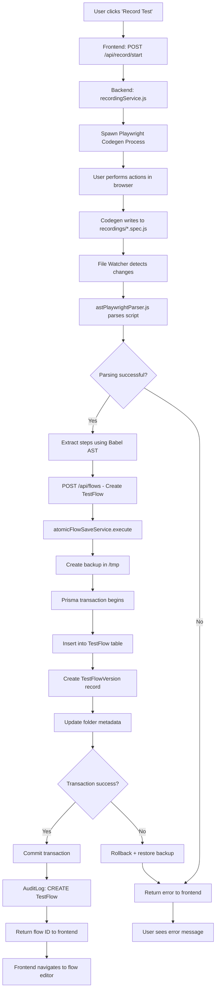

**Detailed Explanation**:
1. **Initiation** (A-D): User triggers recording → Frontend API call → Backend spawns Playwright codegen as child process
2. **Recording** (E-F): User performs actions → Playwright codegen generates JavaScript file in `recordings/` directory
3. **Parsing** (G-J): File watcher detects changes → AST parser (using Babel) extracts steps from JavaScript
4. **Storage** (L-R): Atomic service creates backup → Prisma transaction inserts TestFlow + TestFlowVersion + updates folder
5. **Audit** (V): Every operation logged to AuditLog table for compliance
6. **Error Handling** (U): Transaction rollback + backup restoration on any failure

**Key Services**: `recordingService.js`, `astPlaywrightParser.js`, `atomicFlowSaveService.js`

---

### 2. Single Test Execution Flow

**Purpose**: How a single test flow is executed, monitored, and results are stored.

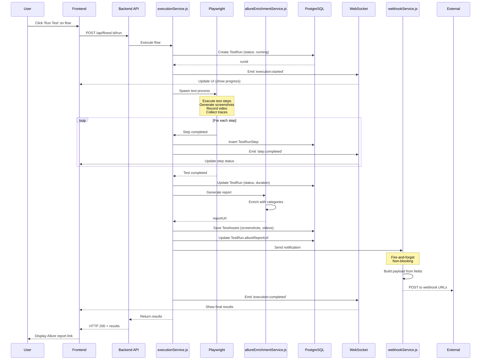

**Detailed Explanation**:

1. **Initiation Phase** (Steps 1-3):
   - User clicks "Run Test" → Frontend sends POST request with flowId
   - Backend validates user permissions via `authMiddleware.js`
   - `executionService.js` receives request

2. **Pre-Execution Phase** (Steps 4-6):
   - Create `TestRun` record with `status: 'running'`, `triggeredBy: userId`, `triggerType: 'manual'`
   - WebSocket emits `execution:started` event to all connected clients
   - Frontend shows loading spinner + progress bar

3. **Execution Phase** (Steps 7-12):
   - Spawn Playwright process as child process
   - For each test step:
     - Execute action (click, type, navigate, etc.)
     - Take screenshot if configured
     - Insert `TestRunStep` record with status, duration, screenshot path
     - Emit real-time progress via WebSocket
   - Video recording runs throughout execution
   - Trace file generated for debugging

4. **Post-Execution Phase** (Steps 13-17):
   - Update `TestRun` with final status (`passed`/`failed`), `endTime`, `duration`
   - Generate Allure report using `allure-commandline`
   - Enrich report with custom categories (P0/P1/P2 failures)
   - Save `TestAssets`: screenshots, video, trace files with sizes
   - Update `TestRun.allureReportUrl`

5. **Notification Phase** (Steps 18-20):
   - Query active webhooks from `WebhookConfig` table
   - Build JSON payload from selected fields (testName, status, reportUrl, etc.)
   - POST to all active webhook URLs (Google Chat, Slack, Teams, Discord)
   - Fire-and-forget: never blocks execution response

6. **Completion Phase** (Steps 21-24):
   - Emit `execution:completed` via WebSocket
   - Frontend displays success/failure banner
   - Return HTTP 200 with TestRun details
   - User clicks report link → Opens Allure HTML report

**Key Services**: `executionService.js`, `allureEnrichmentService.js`, `webhookService.js`

**Database Tables Involved**: `TestRun`, `TestRunStep`, `TestAsset`, `Deviation` (if failures), `AuditLog`

---

### 3. Bulk Execution Flow (Tag-Based)

**Purpose**: Execute multiple tests by tag (e.g., @smoke, @regression) in parallel or sequential mode.

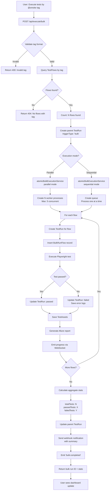

**Detailed Explanation**:

1. **Tag Validation** (A-D):
   - Tag must start with `@` (e.g., `@smoke`, `@regression`, `@e2e`)
   - Query `TestFlow` table: `WHERE tags ARRAY_CONTAINS tag AND status='active'`
   - Return 404 if no flows found

2. **Parent TestRun Creation** (E-F):
   - Create master `TestRun` record:
     - `flowId`: NULL (indicates bulk run)
     - `triggerType`: 'bulk'
     - `tags`: ['@smoke']
     - `triggeredBy`: userId

3. **Execution Mode Selection** (G-K):
   - **Parallel Mode**:
     - Create worker pool (default: 5 concurrent workers)
     - Execute tests simultaneously
     - Faster but resource-intensive
   - **Sequential Mode**:
     - Queue-based execution (one after another)
     - Custom order supported (drag-drop from frontend)
     - Safer for dependent tests

4. **Individual Test Execution** (L-U):
   - For each flow:
     - Create individual `TestRun` (links to parent via `bulkRunId`)
     - Insert `BulkRunFlow` junction record (tracks flow in bulk)
     - Execute Playwright test
     - Save results, screenshots, videos
     - Generate individual Allure report
     - Emit real-time progress: "Test 3 of 10 completed"

5. **Aggregation** (W-Y):
   - After all tests complete:
     - Count passed/failed tests
     - Calculate total duration
     - Update parent TestRun with aggregate stats:
       - `totalTests`: 10
       - `passedTests`: 8
       - `failedTests`: 2
       - `skippedTests`: 0

6. **Notification** (AA):
   - Send webhook with summary:
     ```json
     {
       "testName": "Bulk Execution (@smoke)",
       "totalTests": 10,
       "passedTests": 8,
       "failedTests": 2,
       "duration": "5m 32s",
       "reportUrl": "https://.../allure-reports/bulk-123"
     }
     ```

**Key Services**: `atomicBulkExecutionService.js`, `executionService.js`, `webhookService.js`

**Database Tables**: `TestRun` (parent + children), `BulkRunFlow`, `TestRunStep`, `TestAsset`

---

### 4. Scheduled Execution Flow (CronJobManager)

**Purpose**: Event-driven cron scheduling with PostgreSQL advisory locks for multi-server safety.

```mermaid
flowchart TD
    subgraph Initialization [Server Startup]
        A[Backend server.js starts] --> B[Initialize CronJobManager]
        B --> C[Load all ScheduledExecutions<br/>WHERE enabled=true]
        C --> D[For each schedule]
        D --> E[Decode HTML entities<br/>cronSchedule, timezone]
        E --> F[Create node-cron job]
        F --> G[Store in memory Map<br/>scheduleId → cronJob]
    end
    
    subgraph Runtime [Cron Execution]
        H[Cron time reached<br/>e.g., '0 2 * * *' at 2:00 AM] --> I[node-cron triggers job]
        I --> J[Acquire PostgreSQL<br/>advisory lock]
        J --> K{Lock acquired?}
        
        K -->|No| L[Another server executing<br/>Skip this run]
        K -->|Yes| M[Execute test]
        
        M --> N[Query TestFlows by tag<br/>e.g., @regression]
        N --> O{Execution mode?}
        
        O -->|Sequential| P[Execute in custom order<br/>from executionOrder JSON]
        O -->|Parallel| Q[Execute all simultaneously]
        
        P --> R[atomicBulkExecutionService]
        Q --> R
        
        R --> S[Create TestRun records]
        S --> T[Execute Playwright tests]
        T --> U[Generate Allure reports]
        U --> V[Save results to DB]
        
        V --> W[Update ScheduledExecution]
        W --> X[lastRunAt: now<br/>lastRunStatus: 'completed'<br/>nextRunAt: calculate next]
        
        X --> Y[Release advisory lock]
        Y --> Z[Send webhook notification]
        Z --> AA[Log to AuditLog]
    end
    
    subgraph Dynamic Updates [Real-time Sync]
        BB[User: Create/Update/Delete<br/>schedule via UI] --> CC[POST/PUT/DELETE<br/>/api/schedules]
        CC --> DD[scheduleService.js<br/>saves to DB]
        DD --> EE[Route hook triggers<br/>cronJobManager.syncJob]
        
        EE --> FF{Action type?}
        FF -->|Create| GG[Add new cron job]
        FF -->|Update| HH[Remove old + Add new]
        FF -->|Delete| II[Remove cron job]
        FF -->|Toggle| JJ[Enable/Disable job]
        
        GG --> KK[Update in-memory Map]
        HH --> KK
        II --> KK
        JJ --> KK
        
        KK --> LL[No server restart needed!]
    end
    
    subgraph Missed Job Detection [Startup Recovery]
        MM[Server was down<br/>from 1 AM to 3 AM] --> NN[Server restarts at 3 AM]
        NN --> OO[cronJobManager checks<br/>all enabled schedules]
        OO --> PP{nextRunAt in past?}
        
        PP -->|Yes| QQ[Calculate missed runs<br/>using cron-parser]
        PP -->|No| RR[Schedule normally]
        
        QQ --> SS[Execute missed job now]
        SS --> TT[Update nextRunAt<br/>to next future run]
        TT --> RR
    end
```

**Detailed Explanation**:

#### Initialization Phase (Server Startup)

1. **Loading Schedules** (A-G):
   - On `server.js` startup, initialize `CronJobManager` singleton
   - Query all active schedules: `SELECT * FROM scheduled_executions WHERE enabled=true`
   - For each schedule:
     - Decode HTML entities from frontend: `*&#x2F;5` → `*/5`, `&#x26;` → `&`
     - Create `node-cron` job: `cron.schedule(cronSchedule, executeJob, { timezone })`
     - Store in Map: `scheduleId → cronJob` (in-memory for fast access)

2. **Why In-Memory + Database?**
   - **Database**: Persistent storage, survives server restart
   - **In-Memory (node-cron)**: Active cron jobs that execute at precise time
   - **Sync Strategy**: On startup, load DB → create in-memory jobs

#### Runtime Execution Phase

3. **Cron Trigger** (H-M):
   - At scheduled time (e.g., 2:00 AM daily), `node-cron` triggers callback
   - **PostgreSQL Advisory Lock**:
```sql
     SELECT pg_try_advisory_lock(scheduleId_hash);
     ```
   - **Purpose**: In multi-server deployment, only ONE server executes the schedule
   - If lock fails → another server already executing → skip this run

4. **Test Execution** (N-V):
   - Query flows by tag: `SELECT * FROM test_flows WHERE tags @> ARRAY[tag]`
   - **Sequential Mode**: Execute in custom order (user-defined via drag-drop)
     - `executionOrder`: `["flow-id-1", "flow-id-3", "flow-id-2"]`
   - **Parallel Mode**: Execute all flows simultaneously
   - Use `atomicBulkExecutionService` (same as manual bulk execution)
   - Save all results to `TestRun`, `TestRunStep`, `TestAsset` tables

5. **Post-Execution** (W-AA):
   - Update `ScheduledExecution` table:
     - `lastRunAt`: current timestamp
     - `lastRunStatus`: 'completed' or 'failed'
     - `lastRunId`: TestRun ID for reference
     - `nextRunAt`: Calculate next execution time using `cron-parser`
   - Release advisory lock
   - Send webhook notification (if not disabled)
   - Log to AuditLog: `action: 'EXECUTE_SCHEDULED'`

#### Dynamic Updates (No Restart Needed!)

6. **Real-Time Synchronization** (BB-LL):
   - User modifies schedule in UI → API call → `scheduleService.js` saves to DB
   - **Route Hook** in `scheduleRoutes.js`:
     ```javascript
     // After saving to DB
     req.app.locals.cronJobManager.syncJob(scheduleId, action);
     ```
   - **Actions**:
     - `CREATE`: Add new cron job to in-memory Map
     - `UPDATE`: Remove old job + add new job with updated cron/timezone
     - `DELETE`: Remove job from Map, stop execution
     - `TOGGLE`: Enable/disable job without removing

7. **Why This Matters**:
   - **Old Approach**: Polling every 30 seconds (CPU overhead, imprecise)
   - **New Approach**: Event-driven (zero CPU when idle, precise to the second)
   - **No Restart**: Changes reflect immediately without server downtime

#### Missed Job Detection (Fault Tolerance)

8. **Startup Recovery** (MM-TT):
   - **Scenario**: Server was down from 1 AM to 3 AM, had a schedule at 2 AM
   - On startup at 3 AM:
     - Check all schedules
     - If `nextRunAt < currentTime` → job was missed
     - Execute job immediately
     - Recalculate `nextRunAt` to next future run (e.g., tomorrow 2 AM)

9. **Example**:
   ```javascript
   Schedule: Daily at 2:00 AM
   Server down: 1 AM - 3 AM
   On startup (3 AM):
   - Detect: nextRunAt (2 AM) < now (3 AM)
   - Execute: Run @regression tests now
   - Update: nextRunAt = tomorrow 2 AM
   ```

**Key Services**: 
- `cronJobManager.js` (580+ lines, event-driven scheduler)
- `scheduleService.js` (CRUD operations, validation)
- `atomicBulkExecutionService.js` (test execution)

**Database Tables**: `ScheduledExecution`, `TestRun`, `BulkRunFlow`, `WebhookConfig`

**Industry Pattern**: Follows AWS CloudWatch Events, GitHub Actions, Jenkins cron architecture

---

### 5. Webhook Notification Flow

**Purpose**: Send test results to external services (Google Chat, Slack, Teams, Discord, custom endpoints).

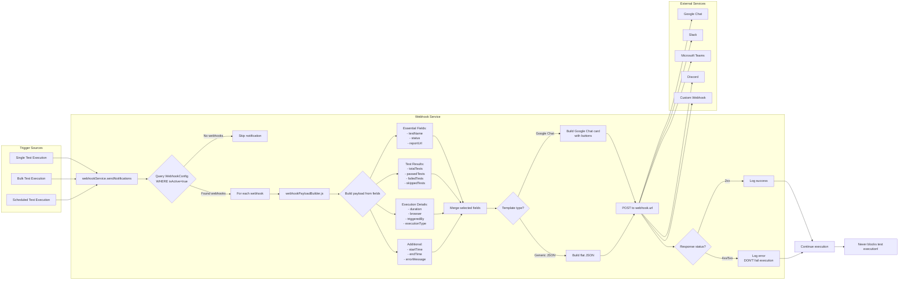

**Detailed Explanation**:

1. **Trigger Points** (A1-A3):
   - **Single Execution**: After test completes in `executionService.js`
   - **Bulk Execution**: After all tests complete in `atomicBulkExecutionService.js`
   - **Scheduled Execution**: After cron job completes in `cronJobManager.js`

2. **Webhook Query** (B-D):
   - Query `WebhookConfig` table: `SELECT * FROM webhook_configs WHERE isActive=true`
   - Multiple webhooks supported (e.g., notify both Slack AND Google Chat)
   - If `disableNotifications=true` in schedule → skip notification

3. **Payload Building** (E-K):
   - **Field-Based Selection** (17 available fields):
     - **Essential** (default selected): testName, status, reportUrl
     - **Test Results**: totalTests, passedTests, failedTests, skippedTests
     - **Execution Details**: duration, browser, triggeredBy, executionType
     - **Additional**: startTime, endTime, completedAt, errorMessage, tags, flowId, runId
   - User selects fields in UI → stored in `WebhookConfig.fields` array
   - `webhookPayloadBuilder.js` merges only selected fields

4. **Template Types** (L-N):
   - **Google Chat Cards** (Rich UI):
     ```json
     {
       "cards": [{
         "header": { "title": "Test Execution: Login Flow" },
         "sections": [{
           "widgets": [
             { "keyValue": { "topLabel": "Status", "content": "✅ Passed" } },
             { "keyValue": { "topLabel": "Tests", "content": "25/25 passed" } }
           ]
         }],
         "buttons": [{ "textButton": { "text": "View Report" } }]
       }]
     }
     ```
   - **Generic JSON** (For Slack, Teams, Discord):
     ```json
     {
       "testName": "Login Flow",
       "status": "passed",
       "totalTests": 25,
       "passedTests": 25,
       "reportUrl": "https://.../allure-reports/run-123"
     }
     ```

5. **Fire-and-Forget** (O-R):
   - **Critical Design Decision**: Webhooks NEVER block test execution
   - POST to webhook URL with 5-second timeout
   - **Success (2xx)**: Log to console, continue
   - **Failure (4xx/5xx)**: Log error, continue (don't fail test)
   - **Why**: External service downtime shouldn't impact test execution

6. **Example Use Cases**:
   - **Google Chat**: Notify QA team in chat room when @smoke tests fail
   - **Slack**: Send daily @regression results to #qa-automation channel
   - **Microsoft Teams**: Alert managers when critical P0 tests fail
   - **Discord**: Notify dev team in Discord server
   - **Custom**: POST to internal monitoring dashboard

**Key Services**: `webhookService.js`, `webhookPayloadBuilder.js`

**Database Table**: `WebhookConfig` (stores URL, selected fields, template, isActive)

**Industry Pattern**: Zapier, n8n, GitHub Webhooks (template-driven, user-configured)

---

### 6. AI Analysis Flow

**Purpose**: AI-powered script analysis, modification, and enhancement.

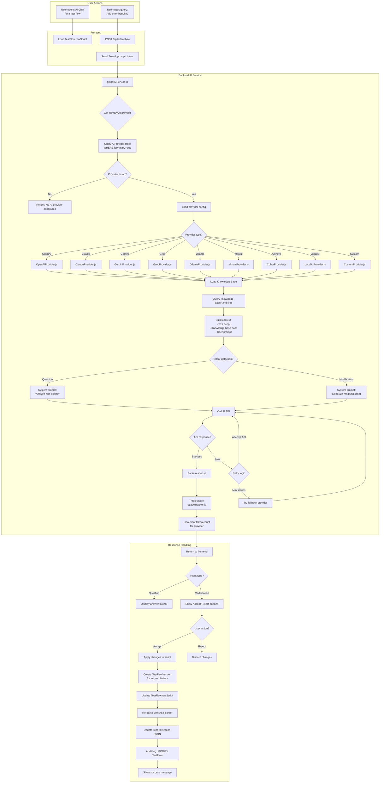

**Detailed Explanation**:

1. **AI Provider Selection** (F-K):
   - System supports 9 AI providers simultaneously
   - One provider marked as `isPrimary=true` (default for requests)
   - Fallback cascade: If primary fails → try next active provider
   - Provider configs stored in `AIProvider` table with encrypted API keys

2. **Knowledge Base Integration** (M-N):
   - Upload Markdown files to `data/knowledge-base/` directory
   - Files indexed and loaded for each AI request
   - Provides context: Playwright best practices, project patterns, coding standards
   - Example: Upload "error-handling-patterns.md" → AI suggests try-catch blocks

3. **Intent Detection** (P-R):
   - **Question Intent** (what/how/why):
     - User: "What does this test do?"
     - AI: Returns explanation, no code changes
     - Frontend: Shows answer in chat
   - **Modification Intent** (add/change/update/fix):
     - User: "Add error handling to login steps"
     - AI: Generates modified script
     - Frontend: Shows Accept/Reject buttons

4. **Retry & Fallback** (V-W):
   - **Retry Logic**: Exponential backoff (1s, 2s, 4s)
   - **Circuit Breaker**: After 5 consecutive failures → disable provider for 5 minutes
   - **Fallback**: If OpenAI fails → try Claude → try Gemini
   - **Why**: Ensures high availability even if one provider has issues

5. **Version Control** (AH-AK):
   - Before modifying test:
     - Create `TestFlowVersion` record (archives current version)
     - Store: `version`, `rawScript`, `changedBy`, `changeReason: 'AI modification'`
   - Update `TestFlow`:
     - Increment `version` field
     - Update `rawScript` with AI-generated code
   - Re-parse script with AST → update `steps` JSON
   - Full rollback supported (restore from `TestFlowVersion`)

6. **Usage Tracking** (X-Y):
   - Track per-provider usage: tokens, requests, errors
   - Stored in `usageTracker.js` (in-memory)
   - Viewable in AI Configuration page
   - Helps monitor quota limits

**Key Services**: 
- `globalAIService.js` (orchestrator)
- `providers/*.js` (9 provider implementations)
- `knowledgeBaseManager.js` (context loader)
- `usageTracker.js` (usage metrics)

**Database Tables**: `AIProvider`, `TestFlow`, `TestFlowVersion`, `AuditLog`

---

### 7. Data Cleanup & Retention Flow

**Purpose**: Automated cleanup of old test artifacts to prevent disk space exhaustion.

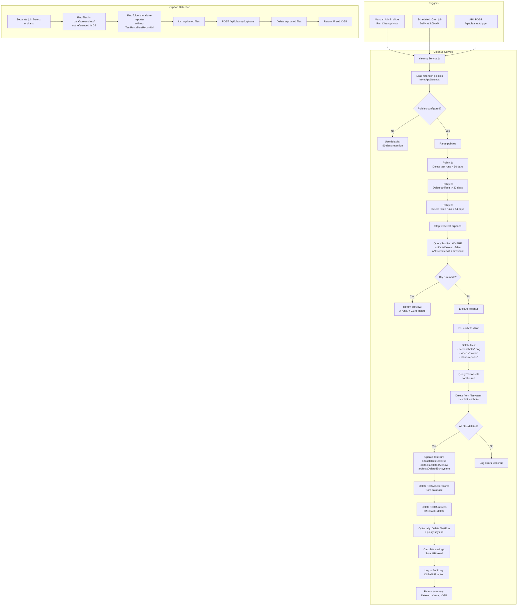

**Detailed Explanation**:

1. **Retention Policies** (C-H):
   - Stored in `AppSettings` table as JSON:
     ```json
     {
       "testRunRetention": 90,        // Days
       "artifactRetention": 30,       // Days  
       "failedRunRetention": 14,      // Days
       "successfulRunRetention": 60   // Days
     }
     ```
   - Configurable per policy type
   - Admin can override defaults in Settings UI

2. **Dry Run Mode** (K-L):
   - **Purpose**: Preview cleanup before execution
   - Returns: "Will delete 150 test runs, 25 GB of artifacts"
   - User reviews → confirms → actual cleanup runs
   - Frontend shows confirmation dialog: "Delete 25 GB?"

3. **Cleanup Process** (M-W):
   - Query eligible test runs:
     ```sql
     SELECT * FROM test_runs 
     WHERE artifactsDeleted = false 
       AND createdAt < (NOW() - INTERVAL '90 days')
     ```
   - For each TestRun:
     - Delete files: `data/screenshots/run-123/*.png`
     - Delete videos: `data/videos/run-123.webm`
     - Delete Allure reports: `allure-reports/run-123/`
     - Update database: `artifactsDeleted=true`
     - Delete `TestAsset` records (CASCADE deletes `TestRunStep`)

4. **Orphan Detection** (BB-HH):
   - **Problem**: Files exist on disk but no DB record references them
   - **Causes**: Interrupted deletions, manual file operations
   - **Detection**:
     - List all files in `data/screenshots/`
     - Compare with `TestAsset.filePath` in database
     - Files not in DB = orphans
   - **Cleanup**: Delete orphaned files, free disk space

5. **Audit Trail** (Y):
   - Every cleanup logged to `AuditLog`:
     ```json
     {
       "action": "CLEANUP",
       "resource": "test_runs",
       "details": {
         "deletedRuns": 150,
         "freedSpace": "25 GB",
         "policy": "90-day retention"
       }
     }
     ```

6. **Statistics Tracking**:
   - Track cleanup history:
     - Last cleanup time
     - Runs deleted
     - Space freed
     - Errors encountered
   - Displayed in Admin → Cleanup page

**Key Services**: `cleanupService.js`, `cleanupScheduler.js` (cron job)

**Database Tables**: `TestRun`, `TestAsset`, `TestRunStep`, `AuditLog`, `AppSettings`

**Cron Schedule**: Daily at 3:00 AM (configurable)

---

### 8. User Authentication & Authorization Flow

**Purpose**: JWT-based authentication with role-based access control (RBAC).

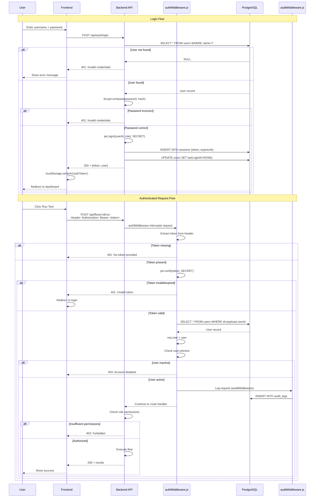

**Detailed Explanation**:

1. **Login Process**:
   - Password stored as bcrypt hash (12 rounds)
   - JWT contains: `{userId, role, exp}`
   - Token expiry: 24 hours (configurable)
   - Session stored in database for tracking

2. **Authentication Middleware**:
   - Runs before EVERY protected route
   - Validates JWT signature
   - Checks token expiry
   - Loads user from database
   - Attaches `req.user` for route handlers

3. **Role-Based Access Control (RBAC)**:
   - **Roles**: admin, user, viewer
   - **Permissions**:
     - `admin`: Full access (create, update, delete, settings)
     - `user`: Create/execute tests, view results
     - `viewer`: Read-only access
   - **Enforcement**: `requireRole('admin')` middleware

4. **Audit Logging**:
   - Every API request logged to `AuditLog` table
   - Captures: userId, action, resource, timestamp, IP address, user agent
   - Used for compliance, security audits, debugging

**Key Services**: `authMiddleware.js`, `authService.js`, `auditMiddleware.js`

**Database Tables**: `User`, `Session`, `AuditLog`

---

## Summary of Data Flows

| Flow Type | Trigger | Key Services | Database Tables | Real-time Updates |
|-----------|---------|--------------|-----------------|-------------------|
| **Test Recording** | User clicks 'Record' | recordingService, astPlaywrightParser, atomicFlowSaveService | TestFlow, TestFlowVersion, Folder | File watcher |
| **Single Execution** | User clicks 'Run' | executionService, allureEnrichmentService, webhookService | TestRun, TestRunStep, TestAsset, Deviation | WebSocket |
| **Bulk Execution** | User executes by tag | atomicBulkExecutionService, executionService | TestRun, BulkRunFlow, TestRunStep | WebSocket |
| **Scheduled Execution** | Cron trigger | cronJobManager, scheduleService, atomicBulkExecutionService | ScheduledExecution, TestRun | PostgreSQL locks |
| **Webhook Notification** | After execution | webhookService, webhookPayloadBuilder | WebhookConfig | Fire-and-forget |
| **AI Analysis** | User chat query | globalAIService, AI providers, knowledgeBaseManager | AIProvider, TestFlow, TestFlowVersion | N/A |
| **Data Cleanup** | Cron/Manual | cleanupService | TestRun, TestAsset, AppSettings | Scheduled |
| **Authentication** | User login | authService, authMiddleware, auditMiddleware | User, Session, AuditLog | N/A |

---

## Migration Commands

```bash
# Generate migration
npx prisma migrate dev --name <migration-name>

# Apply to production
npx prisma migrate deploy

# Reset database (development only)
npx prisma migrate reset

# Generate Prisma client
npx prisma generate

# Open Prisma Studio (DB GUI)
npx prisma studio
```

---

## Schema Location

**File**: `prisma/schema.prisma`

**Database Provider**: PostgreSQL

**Connection**: `DATABASE_URL` environment variable

---

*Last Updated: December 11, 2025*

