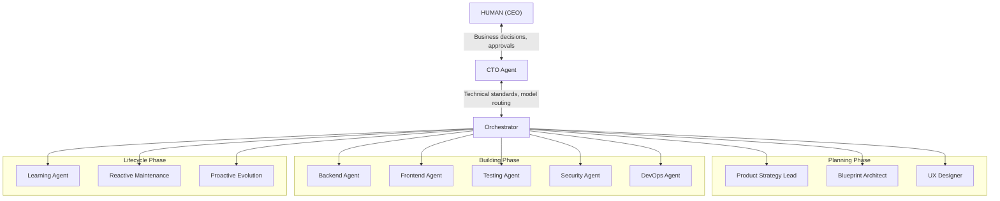
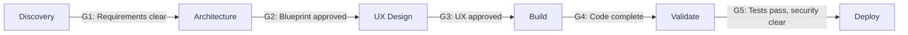

# Multi-Agent Development Framework (MADF)

> A framework for building software with AI — not one AI doing everything, but 13 specialized agents collaborating like a real development team.

---

## Why This Exists

Most people use AI for coding by dumping an entire project into a single conversation and hoping for the best. That works for small scripts, but for anything real — something with a backend, frontend, database, CI/CD, security — a single AI conversation falls apart fast.

MADF takes a different approach. Instead of one AI trying to be everything, it splits the work across **13 specialized agents** — each one focused on what it does best. A product strategist clarifies requirements. An architect designs the system. A frontend developer builds the UI. A security engineer reviews for vulnerabilities. An orchestrator keeps everyone coordinated.

The AI **never guesses**. It asks until it fully understands, then says *"We're aligned. I'll proceed."* Only then does work begin.

---

## Architecture



### The 4-Level Hierarchy

```
HUMAN (CEO)     → Business decisions, approvals, subjective choices
    ↕
CTO Agent       → Technical quality, standards, model routing, research
    ↕
Orchestrator    → Routes work, validates gates, tracks state
    ↕
Specialized     → 10 agents: planning, building, and lifecycle
```

---

## The 13 Agents

| # | Agent | Phase | What It Produces |
|---|-------|-------|-----------------|
| 0 | **Orchestrator** | Always active | PROJECT_STATE.md, routing, gate validation |
| 1 | **Product Strategy Lead** | Planning | MVP_PLAN.md |
| 2 | **Systems Blueprint Architect** | Planning | SYSTEM_BLUEPRINT.md, DECISIONS.md |
| 3 | **UX & Interface Designer** | Planning | UX_SPEC.md |
| 4 | **Backend Agent** | Building | Code + API_CONTRACT.md |
| 5 | **Frontend Agent** | Building | Code + COMPONENT_SPEC.md |
| 6 | **Testing Agent** | Building | Tests + TEST_PLAN.md |
| 7 | **Security Agent** | Building | SECURITY_REVIEW.md |
| 8 | **DevOps Agent** | Building | CI/CD configs + DEPLOYMENT_GUIDE.md |
| 9 | **Learning Agent** | Lifecycle | Captures lessons, proposes rule updates |
| 10 | **Reactive Maintenance** | Lifecycle | Bug fixes, SEV-1/2/3/4 response |
| 11 | **Proactive Evolution** | Lifecycle | Upgrades, migrations, improvements |
| 12 | **CTO Agent** | Above Orchestrator | Technical authority, web research, model routing |

---

## How It Works

### Phase-Gate Workflow



1. **Discovery** — Product Strategy Lead asks targeted questions. No coding starts until requirements are crystal clear.
2. **Architecture** — Blueprint Architect designs the system, logs every decision in DECISIONS.md.
3. **UX Design** — UX Designer creates interface specs.
4. **Build** — Backend, Frontend, Testing, Security, and DevOps agents implement in parallel.
5. **Validate & Deploy** — Quality gates ensure nothing ships without verification.

### The Alignment Protocol

Every agent follows this:
- **When confidence < 80%** → STOP → ASK → CONFIRM → PROCEED
- **Before starting work** → Summarize understanding, list what you'll build, flag unknowns
- **After completing work** → Report confidence level (HIGH / MEDIUM / LOW)

This means the AI never silently makes assumptions. If it's not sure, it asks.

---

## Key Behaviors

| What the AI Does | Why It Matters |
|-------------------|---------------|
| Asks 12 questions before writing a line of code | Vague → Clear. No guessing. |
| Summarizes and asks "Is this accurate?" | Catches misalignment early. |
| Says "We are aligned. I will now proceed." | Explicit signal that discovery is done. |
| Presents options, not just questions | Helps non-technical users decide. |
| Stops and escalates when something is unclear | Doesn't build on a broken foundation. |
| Logs every decision in DECISIONS.md | No re-debating. Ever. |
| Recovers context from PROJECT_STATE.md | No "remind me what we were doing" after a break. |

---

## Quick Setup

```
1. Copy cursor-rules/*.mdc  →  your-project/.cursor/rules/
2. Copy artifacts/*.md       →  your-project/artifacts/
3. Open in Cursor IDE
4. Say: "I want to build [your idea]. Read PROJECT_STATE.md and begin."
```

The Orchestrator activates, routes to the Product Strategy Lead, and the discovery process begins.

---

## Self-Improvement

MADF gets better with every project. The Learning Agent captures what worked and what didn't, detects patterns across projects, and proposes updates to agent rules and templates — with CTO approval.

Every lesson is stored in per-agent learning files, so the framework doesn't repeat mistakes.

---

## File Structure

```
multi-agent-development-framework/
├── README.md                 ← You are here
├── FRAMEWORK.md              ← Complete architecture reference
├── MASTER_PROMPT.md          ← Single prompt to recreate MADF
├── PROJECT_BOOTSTRAP.md      ← Step-by-step new project setup
├── architecture/             ← Architecture diagrams (draw.io)
├── agents/                   ← 9 agent behavior definitions
│   ├── 00-orchestrator.md
│   ├── 01-product-strategy.md
│   ├── 02-system-blueprint.md
│   ├── 03-ux-designer.md
│   ├── 04-backend.md
│   ├── 05-frontend.md
│   ├── 06-testing.md
│   ├── 07-security.md
│   └── 08-devops.md
├── artifacts/                ← Output templates for each phase
│   ├── MVP_PLAN.md
│   ├── SYSTEM_BLUEPRINT.md
│   ├── UX_SPEC.md
│   ├── API_CONTRACT.md
│   └── ... (12 artifact templates)
└── cursor-rules/             ← Cursor IDE rule files (.mdc)
```

---

## Companion Project

MADF builds the software. **[TAFF (Test Automation Framework Factory)](../test-automation-framework-factory/)** builds the test frameworks for that software. Same architecture, same alignment protocol, different domain.

| | MADF | TAFF |
|---|------|------|
| **Purpose** | Build applications | Build test frameworks |
| **Agents** | 13 (development-focused) | 16 (testing-focused) |
| **Output** | Production applications | Production test suites |
| **Shared** | 4-level hierarchy, alignment protocol, self-improvement |

---

## License

MIT
