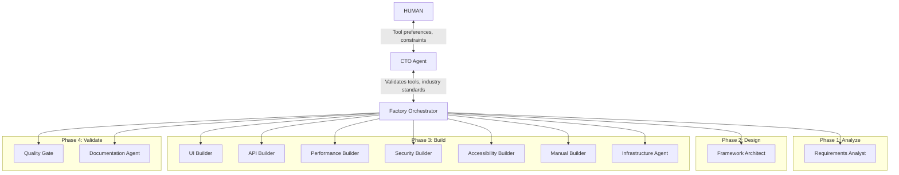
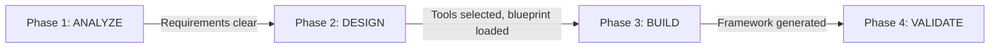

# Test Automation Framework Factory (TAFF)

> A meta-framework that generates production-ready test automation frameworks using AI agents. Tell it what you need — it builds the entire framework.

---

## What This Is

Most teams build test frameworks one at a time, reinventing the same patterns for every project — config management, parallel execution, reporting, CI/CD, retry logic. By the time you've solved all these cross-cutting concerns, you've spent weeks before writing a single test.

TAFF solves this differently. It encodes expert knowledge into **blueprints** — detailed guides that capture exactly how a senior SDET would build a framework for a specific tool. Then it uses **16 specialized AI agents** to assemble a complete, deployable framework on demand.

**TAFF is not a framework. It's a factory that builds frameworks.**

---

## What It Generates

| Testing Type | Tools Supported | What You Get |
|-------------|----------------|-------------|
| **UI / E2E** | Playwright, Cypress, Selenium (Java) | Page objects, parallel execution, visual testing, Docker, CI/CD, Allure reports |
| **API** | SuperTest (TS), pytest (Python) | Request builders, schema validation, auth, contract tests, CI/CD |
| **Performance** | k6 (JS), Locust (Python) | Load/stress/soak scenarios, thresholds, Grafana dashboards, CI gates |
| **Security** | OWASP ZAP | DAST scanning, dependency audit, authenticated scans, CI gates |
| **Accessibility** | axe-core + Playwright | WCAG 2.1 AA scanning, violation reports, CI gates |
| **Manual Testing** | Tool-agnostic | Templates, checklists, traceability matrix, reporting |

---

## Architecture



### The 4-Level Hierarchy

```
HUMAN (CEO)          → Tool preferences, team size, constraints
    ↕
CTO Agent            → Industry standards, tool validation, model routing
    ↕
Factory Orchestrator → Workflow coordination, state management, gates
    ↕
Specialized Agents   → 13 agents: analyze, design, build, validate
```

---

## The 16 Agents

| Agent | Role |
|-------|------|
| **CTO Agent** | Technical authority — validates tool choices, manages model routing |
| **Factory Orchestrator** | Coordinates workflow, manages state, validates phase gates |
| **Requirements Analyst** | Turns vague requests into structured requirements |
| **Framework Architect** | Uses decision matrices to select the right tools and blueprints |
| **UI Automation Builder** | Generates Playwright, Cypress, or Selenium frameworks |
| **API Testing Builder** | Generates SuperTest or pytest frameworks |
| **Performance Builder** | Generates k6 or Locust frameworks |
| **Security Builder** | Generates OWASP ZAP CI pipelines |
| **Accessibility Builder** | Generates axe-core + Playwright accessibility suites |
| **Manual Testing Builder** | Generates test management structures |
| **Infrastructure Agent** | Adds CI/CD, Docker, reporting to generated frameworks |
| **Quality Gate Agent** | Validates generated frameworks against blueprints |
| **Documentation Agent** | Writes README, setup guides, contribution docs |
| **Learning Agent** | Captures lessons, proposes blueprint and pattern updates |
| **Reactive Maintenance** | Fixes broken tests, CI failures, flakiness |
| **Proactive Evolution** | Upgrades dependencies, adds new patterns |

---

## How It Works



### Example Flow

**You say:** *"I need a UI automation framework for a React web app. TypeScript. Playwright. GitHub Actions CI. Team of 3."*

1. **Requirements Analyst** asks follow-up questions: How many tests? Cross-browser? Visual regression? Staging environment?
2. **Framework Architect** scores tools against the decision matrix, selects Playwright blueprint, picks shared patterns (config, reporting, CI/CD, parallel execution, Docker, retry, auth).
3. **UI Builder** generates the complete framework from the blueprint — 30+ files including page objects, example tests, utilities.
4. **Infrastructure Agent** adds GitHub Actions workflow, Docker support, Allure reporting.
5. **Quality Gate** validates: all example tests run, parallel execution works, Docker builds, CI pipeline configured.
6. **Documentation Agent** writes the README for your new framework.

**You get:** A production-ready Playwright framework ready to clone and start writing tests.

---

## Key Concepts

### Blueprints

Blueprints encode **expert knowledge** for each testing tool. The Playwright blueprint doesn't just list features — it defines the exact architecture, patterns, and configuration a senior SDET would use. When the UI Builder follows a blueprint, it produces a framework indistinguishable from one built by an expert.

**10 blueprints** across 6 testing types:
- **UI**: Playwright (TypeScript), Cypress (TypeScript), Selenium (Java)
- **API**: SuperTest (TypeScript), pytest (Python)
- **Performance**: k6 (JavaScript), Locust (Python)
- **Security**: OWASP ZAP (CI pipeline)
- **Accessibility**: axe-core + Playwright
- **Manual**: Test management structure

### Shared Patterns

Cross-cutting concerns solved once and reused across every generated framework:

| Pattern | What It Solves |
|---------|---------------|
| Config Management | Environment-aware configuration |
| Reporting | Allure, HTML, JSON report generation |
| CI/CD Integration | GitHub Actions, GitLab CI, Jenkins |
| Test Data Management | Fixtures, factories, cleanup |
| Parallel Execution | Thread-safe concurrent test runs |
| Logging & Observability | Structured logs, dashboards |
| Docker Containerization | Reproducible test environments |
| Retry & Stability | Flaky test handling, auto-retry |
| Auth Patterns | Token management, session handling |

### Decision Matrices

Structured tool selection across 10+ weighted dimensions:
- **UI Tool Matrix**: Playwright vs Cypress vs Selenium
- **API Tool Matrix**: SuperTest vs pytest vs REST Assured
- **Performance Tool Matrix**: k6 vs Locust vs Gatling
- **CI Platform Matrix**: GitHub Actions vs GitLab CI vs Jenkins

---

## Quick Setup

```
1. Copy cursor-rules/*.mdc  →  your-project/.cursor/rules/
2. Open in Cursor IDE
3. Say: "I need a [type] automation framework for [your app]."
4. The factory takes over — analyze, design, build, validate.
```

---

## Self-Improvement

Every framework generation makes the factory smarter. The Learning Agent captures what worked and what didn't, detects patterns, and proposes updates to blueprints, shared patterns, and decision matrices — all with CTO approval.

---

## File Structure

```
test-automation-framework-factory/
├── README.md                  ← You are here
├── FRAMEWORK.md               ← Complete architecture, all 16 agents
├── MASTER_PROMPT.md            ← Single prompt to recreate TAFF
├── architecture/              ← Architecture diagrams (draw.io)
├── blueprints/                ← 10 tool-specific expert knowledge guides
│   ├── ui/                    ← Playwright, Cypress, Selenium
│   ├── api/                   ← SuperTest, pytest
│   ├── performance/           ← k6, Locust
│   ├── security/              ← ZAP
│   ├── accessibility/         ← axe-core
│   └── manual/                ← Test management
├── shared-patterns/           ← 9 cross-cutting concern guides
├── decision-matrices/         ← 4 structured tool selection guides
├── artifacts/                 ← Runtime state templates
└── cursor-rules/              ← 16 agent behavior files (.mdc)
```

---

## Companion Project

TAFF builds the test frameworks. **[MADF (Multi-Agent Development Framework)](../multi-agent-development-framework/)** builds the software being tested. Same architecture, same alignment protocol, different domain.

| | MADF | TAFF |
|---|------|------|
| **Purpose** | Build applications | Build test frameworks |
| **Agents** | 13 (development-focused) | 16 (testing-focused) |
| **Output** | Production applications | Production test suites |
| **Shared** | 4-level hierarchy, alignment protocol, self-improvement |

---

## License

MIT
